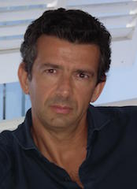

# Coalizione di Centro Destra

- [Candidato Sindaco](#massimo-zanello-candidato-sindaco)
- [Programma](#programma)

## Forze Politiche della Coalizione

- [Desio Al Centro](desio-al-centro.md)
- [Forza Italia Desio](forza-italia.md)
- [Fratelli D'Italia - Alleanza Nazionale](fratelli-ditalia-alleanza-nazionale.md)
- [La Nostra Desio](la-nostra-desio.md)
- [Lega Nord](lega-nord.md)

## Massimo Zanello (candidato sindaco)

Sono padre di due figli, Lorenzo e Beatrice di 15 e 18 anni. Dal 1988 al 1994 sono stato consigliere comunale a Villa Cortese (MI), dove dal 1993 al 1994 ho ricoperto la carica di Assessore comunale al Bilancio.

Dal 1990 al 1995 sono stato consigliere provinciale a Milano, ricoprendo dal 1994 al 1995 la carica di Presidente della Provincia di Milano. Nel 1995 sono stato nominato anche Assessore al Commercio nel Comune di Milano.

Ho ricoperto la carica di Consigliere regionale dal 1995, eletto nel collegio di Milano. Nel 2000 sono stato rieletto consigliere regionale nella circoscrizione di Milano, ed ho ricoperto per l'intera legislatura l'incarico di Assessore regionale con delega all'industria, alla piccola e media impresa e alla cooperazione.

Candidato nuovamente alle elezioni regionali del 2005 nella circoscrizione di Monza e Brianza, sono stato riconfermato in Consiglio regionale nelle file della Lega Nord, Presidente del gruppo consiliare.

Da luglio 2006 ad aprile 2010 sono stato Assessore alle Culture, Identità e Autonomie della Lombardia. Da maggio 2010 ricopro la carica di Sottosegretario del Presidente della Regione Lombardia con delega al cinema.

### Intervista 1

**Quali sono le priorità per la città?**

> «Le priorità non sono poche. C’è quella delle grandi incompiute e degli edifici abbandonati. C’è la necessità di un rilancio della città che parta dal centro - perché non è possibile assistere alla morìa dei negozi e alla gente che cade sulle rotaie del tram - senza dimenticare i quartieri. C’è la necessità di valorizzare il patrimonio storico e culturale di Desio come merita: penso a Villa Tittoni, che proporremo di far diventare patrimonio dell’Unesco, e alla figura del Papa, che merita di essere valorizzata. Per tutto questo Desio deve entrare in un contesto più grande, deve diventare un polo di attrazione per persone anche dai comuni limitrofi e non solo».

**Quale sarebbe il suo primo atto ufficiale da sindaco?**

> «Avvierò un profondo monitoraggio del patrimonio del Comune, per capire come valorizzarlo e come rilanciarlo, e del patrimonio dismesso, penso alla Torre, al Centro Stile, a tutte quelle realtà immobiliari che hanno bisogno di una rinascita. Essendo percorsi lunghi, bisogna iniziare subito e con grande determinazione».

**Perché i cittadini dovrebbero votare per lei?**

> «Perché è l’unico modo per far ripartire Desio in un contesto di più ampio respiro. La città è rimasta uguale a cinque anni fa, anzi è regredita e non è al passo nemmeno delle città limitrofe: basta guardare il valore delle case, che qui è inferiore a Seregno, Cesano e Lissone. Il motivo è chiaro. Desio è una città che ha perso ogni attrattività. Deve riprendersi il suo ruolo chiave, insieme alle forze sane della popolazione, che sono tante». 

[Fonte](http://www.ilgiorno.it/monza-brianza/desio-candidati-sindaco-1.2139136)

## Programma

In questo difficile frangente per la nostra comunità due sono i rischi: da una parte lo smarrimento, la delusione e quindi la fuga e il disimpegno; dall'altra il lento scivolamento delle menti e delle volontà verso il pensiero unico.

Noi non ci vogliamo arrendere: vogliamo un futuro diverso. Crediamo che sia possibile lacostruzione di un'alternativa culturale e programmatica, prima ancora che politica. Siamo fortemente ancorati ai valori della libertà e della responsabilità individuale ed allatradizione giudaico/cristiana dell’Europa, che non può rinunciare alla propria storia ed aipropri valori in nome di un mondialismo dominato da tecnocrati e banchieri o ancor peggiogenuflettersi ad altre religioni pensando di essere democratica.

Noi crediamo nella libertà personale e d’impresa che deve garantire l’uguaglianza delleopportunità per tutti i cittadini e in una società fondata sul senso civico e costituita dacittadini liberi e forti che vivono in un sistema di leggi certe, con diritti individuali garantiti.

Vogliamo lottare con fermezza contro il crimine organizzato e la corruzione politica; leideologie totalitarie e religioni fondamentaliste; l’uso distorto delle nuove tecnologie; l’allentarsi dei vincoli di solidarietà sociale e familiare; il degrado ambientale e culturale.

Riteniamo che il sistema delle autonomie locali rappresenti la linfa vitale della democrazia.

### 1. Sicurezza e legalità

> DESIO: CITTA' SERENA E VIVIBILE

1. Installazione di telecamere di sorveglianza, soprattutto nelle zone più isolate e nelle aree verdi, dotando le stesse anche di colonnine SOS, collegate direttamente con le forze dell'ordine.
2. Controllo del territorio: valorizzazione e potenziamento dei comitati di quartiere apartitici.
3. Realizzazione di un nuovo “piano comunale dell'illuminazione”, utilizzando tecnologie moderne ed ecosostenibili.
4. Presidio e monitoraggio delle zone potenzialmente più pericolose, specialmente negli orari di minore frequentazione e realizzazione di parcheggi destinati alle donne, individuando gli spazi più idonei in termini di illuminazione e vicinanza a zone di passaggio.
5. Collaborazione con le forze dell'ordine (Carabinieri, Protezione Civile e Vigili del Fuoco e Associazioni d'Arma).
6. Rafforzamento del terzo turno della Polizia Locale.
7. Sviluppo e promozione dell'iniziativa dei “nonni vigili” presso le scuole per la gestione dell'afflusso e deflusso degli alunni negli orari di entrata e di uscita della scuola.
8. Controlli, in collaborazione con le scuole e i servizi sociali, sui minori e sulle donne, possibili vittime di violenze domestiche e/o psicologiche.
9. Ripristino dello sportello anti violenza per donne, bambini e adolescenti.
10. Creazione di una consulta sulla legalità per prevenire e contrastare episodi/situazioni delinquenziali di tipo microcriminale.

#### Immigrazione e politiche di integrazione

1. Sostegno alla politica di cooperazione internazionale, finalizzata all'aiuto delle popolazioni più svantaggiate nel Paese d'origine.
2. Opposizione all'accoglienza indiscriminata e alle imposizioni della prefettura, sollecitando l'accelerazione dell'evasione delle pratiche di verifica delle richiesta d'asilo. Favorire la partecipazione attiva dei profughi accertati a iniziative di riqualificazione del territorio.
3. Controllo delle abitazioni che ospitano un eccessivo numero di inquilini/proprietari per eliminare situazioni di degrado o la creazione di ghetti.
4. Costante monitoraggio degli insediamenti delle famiglie rom: tolleranza zero verso l'illegalità, il degrado e il non rispetto delle norme in materia igienico-sanitaria. Applicazione puntuale delle ordinanze di sgombero.
5. Controllo di mendicanti ed abusivi nelle zone più frequentate da anziani (cimitero, supermercati, vie principali...).

### 2. Lavoro, Commercio e Attività produttive

> DESIO: CITTA' IN CRESCITA

La ricerca di lavoro sia per i giovani che per i lavoratori e lavoratrici che hanno superato i 50 anni e che si trovano temporaneamente espulsi dal mercato del lavoro rappresenta una priorità assoluta nel nostro programma, pertanto creare a Desio un clima accogliente che agevoli l’attività e la crescita delle aziende è fondamentale per aumentare le opportunità occupazionali dei cittadini desiani. Per aggredire il problema occupazionale riteniamo necessario procedere con le seguenti misure:

1. Creazione di un tavolo permanente con le imprese della Città per monitorare costantemente le problematiche e opportunità esistenti sul territorio in modo da intervenire tempestivamente nelle situazioni.
2. Riduzione delle imposte locali o contributi alle nuove imprese che si insediano sul territorio e alle imprese che assumono nuovi lavoratori.
3. Costante collaborazione con gli operatori accreditati del mercato del lavoro per aumentare le opportunità di chi cerca lavoro e offrire il meglio dell’offerta lavorativa alle aziende.
4. Collaborazione con le agenzie pubbliche e private del territorio per potenziare al massimo gli strumenti della conciliazione famiglia/lavoro.
5. Riqualificazione dell'arredo urbano, sull'asse Corso Italia – Via Garibaldi – Via Lampugnani.
6. Rimozione dei binari del tram.
7. Promozione di sinergie pubblico/private indirizzate a rivitalizzare il centro, al fine di renderlo un "salotto" di socializzazione.
8. Rivitalizzazione della Piazza Don Giussani, con il rilancio dell'attività commerciale anche ambulante e come luogo di aggregazione giovanile.
9. Sostegno e promozione, attraverso bandi ad hoc, dell'apertura di botteghe tradizionali e di piccolo commercio, che privilegino la vendita di prodotti locali, con agevolazioni per la cittadinanza e i comuni limitrofi.
10. Realizzazione di occasioni di incontro tra imprese e persone, in cerca di occupazione, ed erogazione di corsi di orientamento, riqualificazione e occupazione tramite enti specializzati a tariffe di favore.

### 3. Urbanistica, Edilizia e Governo del territorio

> DESIO: CITTA' A MISURA D'UOMO

1. Blocco del consumo del territorio.
2. Semplificazione delle norme urbanistiche, mantenendo invariate le volumetrie, le altezze e le caratteristiche architettoniche delle facciate.
3. Applicazione delle norme regionali della legge 12/2015, sul recupero ai fini abitativi dei sottotetti.
4. Parcheggi gratuiti per tutti i desiani.
5. Miglioramento dei collegamenti ciclo-pedonali fra periferia e centro.
6. Riqualificazione dell'ex area ATM destinandola ad area totalmente a verde.
7. Massima attenzione al completamento dei lavori della metrotramvia, studiando soluzioni atte a limitare al massimo i danni alla viabilità.
8. Grande vigilanza sulle opere di compensazione ambientale.
9. Mantenimento della destinazione urbanistica dell'area della Casa di Riposo “PioGavazzi” di Corso Italia, esclusivamente per “servizio socio-sanitari” dedicati agli anziani.
10. Massima collaborazione con il curatore fallimentare per giungere ad una soluzione, nell'interesse della Città, rispetto alla situazione della torre “ex Autobianchi” di via Milite Ignoto.
11. Cura puntuale del verde pubblico.
12. Attenta analisi della situazione degli stabili in disuso presenti in Città. Valutazione sull'opportunità di alienare o riqualificare le proprietà comunali (ex ITIS, ex Agenzia delle Entrate, Palazzina Cremonini ex Autobianchi, Tettoia ex Gavazzi). Collaborazione con le proprietà, sia pubbliche sia private, al fine di giungere ad una sistemazione di altre aree non più utilizzate presenti sul territorio (ex Consorzio agrario, ex Palazzo dell'arredamento).
13. Estensione del WI-FI gratuito in altre zone della città come parco e stazione.

### 4. Sport e Tempo libero

> DESIO: CITTA' SANA E DIVERTENTE

1. Completamento della palestra della ginnastica ritmica nazionale.
2. Potenziamento del polo natatorio con la creazione della vasca da 50 metri e della vasca di profondità.
3. Riqualificazione del Centro Sportivo esistente e realizzazione di una vera e propria “Cittadella dello Sport”, tale da essere meglio fruibile dalla cittadinanza e per poter incrementare la frequenza di eventi a carattere sovracomunale nonché di rilevanza nazionale e internazionale; in questo spazio realizzazione di un campo polifunzionale in materiale sintetico.
4. Riqualificazione o edificazione ex novo di strutture sportive, in particolare quelle di quartiere legate alle varie scuole.
5. Completamento dell'area festa adiacente il PalaBancoDesio.
6. Collaborazione con le diverse istituzioni regionali, nazionali ed europee per dare visibilità ai bandi regionali.
7. Riqualificazione del parco comunale e delle diverse aree verdi presenti in città, con istituzione di aree adibite alle diverse tipologie di fruitori (panchine, sentieri agibili anche da disabili e passeggini, percorso vita, recinti per cani, aree attrezzate per i bambini, aree attrezzate per il solarium,...); creazione di nuove aree verdi soprattutto nelle zone periferiche.
8. Costituzione di una “Consulta sportiva organizzativa” che possa mettere in rete le associazioni sportive presenti sul territorio, delegati del CONI e CSI, varie Federazioni Sportive e l’ Amministrazione, per studiare un progetto interdisciplinare che coinvolga i giovani nella comprensione del valore educativo dello sport.

### 5. Cultura

> DESIO: CITTA’ CON IL “BELLO” A 360°

1. Promozione, insieme a Milano, Monza e Regione Lombardia, delle architetture del Piermarini presenti nella città e nel circondario, al fine del loro riconoscimento come patrimonio dell'UNESCO.
2. Realizzazione di una sala polifunzionale, dotata di palcoscenico, torre scenica e quinte, al fine di poter ospitare anche spettacoli di caratura nazionale.
3. Valorizzazione dei beni architettonici, culturali, tradizionali e della storia locale con la creazione di percorsi tematici all’interno della città e nei dintorni, per far conoscere la storia, le tradizione e la cultura locali.
4. Implementazione delle realtà che già sul nostro territorio si occupano di cultura.
5. Valorizzazione dei luoghi legati alla vita di Papa Pio XI e organizzazione di una rete di iniziative con i comuni di Sotto il Monte (città natale di Papa Giovanni XXIII) e Concesio (città natale di Papa Paolo VI), al fine di costituire un asse culturale permanente che valorizzi i tre grandi papi lombardi del XX secolo.
6. Miglioramento della biblioteca: aumento dell’orario di apertura; introduzione della possibilità di effettuare fotocopie a prezzo contenuto; raccolta di dvd/libri usati e materiale di cancelleria da donare a studenti in difficoltà economica; incontri letterari e presentazione di libri; individuazione di spazi gratuiti dopo poter fornire ripetizioni.
7. Individuazione di spazi comunali da destinare a luogo espositivo gratuito, o comunque a costo esiguo, per giovani artisti che spesso, a causa di costi proibitivi, non trovano luoghi ove poter esporre le loro opere.

### 6. Sociale

> DESIO: CITTA’ ATTENTA ALLA FAMIGLIA

1. Anziani come risorsa: “La Banca del tempo”, voucher, progetti con le scuole.
2. Anziani come bisogni: fondo per le non autosufficienze; buoni sociali per chi accudisce un anziano; implementazione del servizio di incontro badanti/famiglie, con particolare riferimento alle lavoratrici lombarde; creazione del CAF comunale per aiutare gli anziani nell’espletamento delle pratiche burocratiche; assistente di “quartiere, via, palazzo”.
3. Diversamente abili: superamento delle barriere architettoniche sia nella Città che all’interno di edifici comunali, pubblici e di maggior utilità, attenzione ai non vedenti/non udenti in relazione alla fruizione dei servizi comunali e dei percorsi; realizzazione nelle zone verdi cittadine di aree gioco fruibili anche da bambini diversamente abili; sostegno alle famiglie con familiari affetti da malattie degenerative, invalidanti, psichiatriche e collaborazione con il CDD, il SIL e le altre strutture operanti sul territorio.
4. Regolamenti attuativi sull'assegnazione dei servizi: verifica puntuale e rigorosa dei parametri ISEE tenendo in considerazione la priorità riferita alla residenza dal maggior numero di anni in Lombardia
5. Costituzione di un openspace in collaborazione con le associazioni aperto ai cittadini fra i 12 e i 18 anni; all'interno un centro di ascolto per ragazzi e famiglie.
6. Voucher spendibili in buoni spesa, presso i commercianti desiani che entreranno a far parte della rete di imprese partners del Comune, destinati a famiglie con nuovi nati, anziani, disabili, persone in difficoltà economica.

### 7. Istruzione

> DESIO: A SCUOLA CON GIOIA PER CRESCERE INSIEME

1. Stretta e costante collaborazione con i Dirigenti Scolastici, i Consigli di Istituto, i Docenti, i Genitori e gli Operatori Scolastici.
2. Potenziamento degli asili nido e delle scuole d'infanzia.
3. Costante monitoraggio della qualità e dei costi dei servizi complementari: mensa, servizi pre e post scuola, trasporti.
4. Sostegno concreto per la disabilità e per il disagio scolastico, sia a livello educativo che didattico.
5. Concreta collaborazione con Istituzioni e Associazioni per favorire la crescita dei ragazzi come cittadini consapevoli dei diritti e doveri.
6. Messa a norma e puntuale manutenzione, straordinaria e ordinaria, degli edifici scolastici e del verde di pertinenza.
7. Costante collaborazione con il Consiglio Comunale di ragazzi/Consulta giovanile (fasce d’età diverse).
8. Dialogo con i servizi privati accreditati.
9. Creazione di Centri Estivi in lingua inglese (Summer Camp) a costi calmierati.
