# Desio Viva

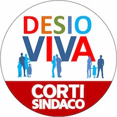

Forza politica appartenente alla [coalizione di centro sinistra](coalizione-di-centro-sinistra.md) che supporta il candidato sindaco [Roberto Corti](coalizione-di-centro-sinistra.md#roberto-corti-candidato-sindaco).

- [Candidato Sindaco](coalizione-di-centro-sinistra.md#roberto-corti-candidato-sindaco)
- [Programma](coalizione-di-centro-sinistra.md#programma)
- [Lista Candidati](#lista-candidati)
- [Biografie Candidati](#biografie-candidati)

## Lista Candidati

| Nome | Luogo di nascita | Data di nascita | Foto | Occupazione | Biografia |
|------|------------------|-----------------|:----:|:-----------:|:---------:|
| Antonio Adelchino | Seregno | 25/02/1944 | 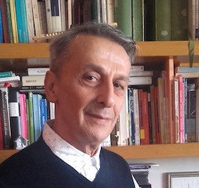 | Pensionato | |
| Antonio D'Ovidio | Cupello | 13/02/1960 | 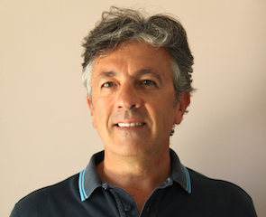 | | |
| Claudio Arienti | Desio | 12/05/1976 | 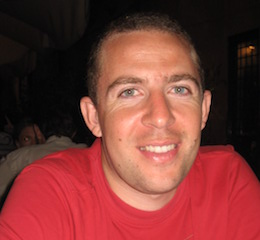 | Impiegato | |
| Danilo Michele Zaggia | Godovic | 29/09/1942 | 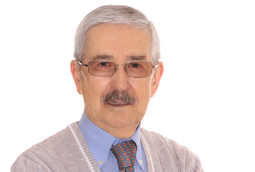 | Pensionato | |
| Edoardo Sebastianelli | Desio | 08/05/1997 | 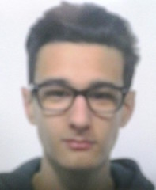 | Studente lavoratore | |
| Francesco Chignoli | Vaprio D'Adda | 31/07/1943 | 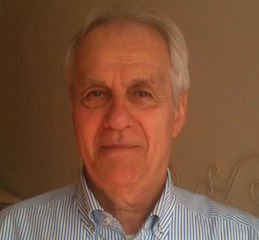 | | |
| Francesco Pasquali | Desio | 26/01/1977 | 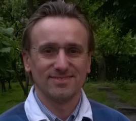 | Avvocato | |
| Giovanna Abile |  Lissone | 09/06/1954 | 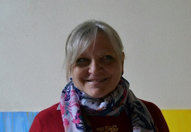 | Insegnante | |
| Luca Luraghi | Desio | 27/04/1987 | 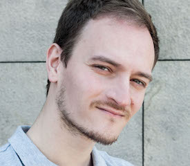 | | |
| Marco Beretta | Milano | 28/05/1974 | 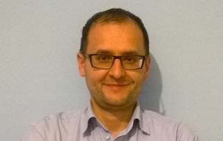 | Farmacista | [:link:](#marco-beretta) |
| Maria Rosa Arienti | Desio | 24/06/1971 | 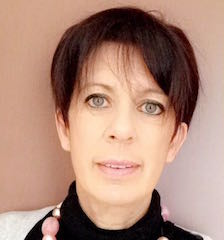 | Insegnante | |
| Maria Zaffino | Catanzaro | 01/11/1962 | 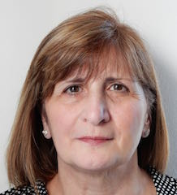 | Insegnante | |
| Marzia Micozzi | Paderno Dugnano | 22/03/1965 |  | | |
| Michele Notarangelo | Taranto | 24/09/1974 | 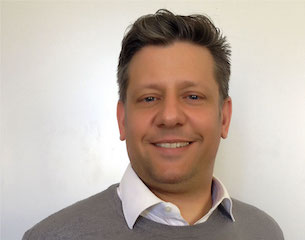 | Impiegato | |
| Paolo Luca Pesarin | Sesto San Giovanni | 27/08/1964 | 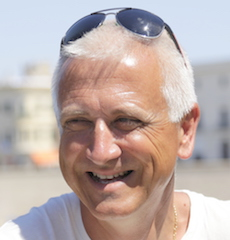 | | |
| Patrizia Ciccotti | Desio | 19/02/1963 | 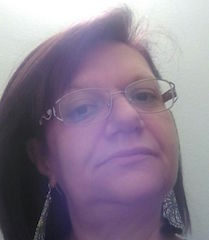 | | |
| Renato Arienti | Desio | 06/03/1934 | 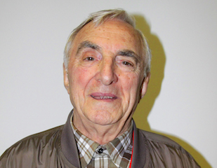 | Pensionato | |
| Silvia Riva | Desio | 10/06/1972 | 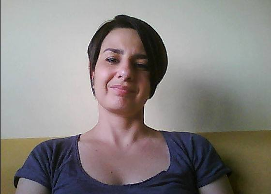 | | |
| Simona Barlassina | Desio | 30/08/1983 | 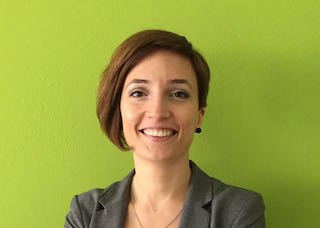 | Impiegata | |
| Stefano Bruno Guidotti | Carrara | 23/12/1961 | 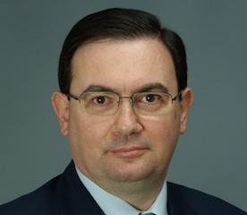 | Medico | |
| Stefano Giacomelli | Tirano | 30/06/1976 | 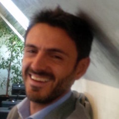 | | |
| Tiberio Strati | Como | 03/09/1972 | 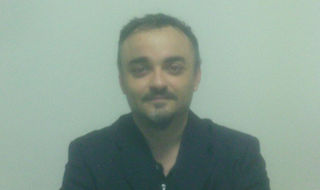 | | |
| Valentino Luè | Milano | 05/02/1968 | 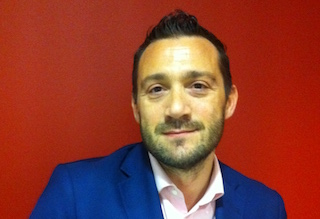 | | |
| Viviana Di Berardino | Milano | 31/03/1958 | 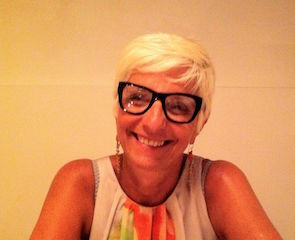 | | |

## Biografie Candidati

### Marco Beretta

- **Occupazione**: farmacista
- **Luogo di nascita**: Milano
- **Data di nascita**: 28/05/1974

Sono sposato, quattro figli, mi piace impegnarmi per migliorare città in cui vivo da sempre. La mia città.

Nella mia breve esperienza di consigliere comunale ho cercato di affrontare i problemi, confrontandomi sempre in maniera propositiva con gli altri, animato dal piacere che si ha nel ragionare con punti di vista differenti su una qualunque questione, cercando di prestare attenzione al punto di vista altrui, di affrontare le criticità, di assumere la responsabilità delle scelte fatte, argomentandole e cercando di spiegarle agli altri.

Ho cercato di dare il massimo sia come tempo dedicato, per quanto compatibilmente con le esigenze familiari, sia come impegno e buona volontà che umilmente credo di poter dire di aver messo a disposizione. Spero di poter proseguire nel progetto forte di cambiamento della città iniziato da questa amministrazione, attraverso scelte di onestà, trasparenza, ragionevolezza ed allargamento della partecipazione; un percorso non sempre facile, ma certamente tracciato, di riscatto dal recente passato, a cui sono certo di aver contribuito insieme ad altri consiglieri comunali, sia di maggioranza che, a onor del vero, di opposizione.
