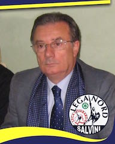
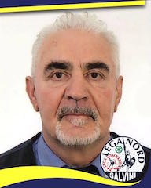

# Lega Nord

Forza politica appartenente alla [coalizione di centro destra](coalizione-di-centro-destra.md) che supporta il candidato sindaco [Massimo Zanello](coalizione-di-centro-destra.md#massimo-zanello-candidato-sindaco).

- [Candidato Sindaco](coalizione-di-centro-destra.md#massimo-zanello-candidato-sindaco)
- [Programma](coalizione-di-centro-destra.md#programma)
- [Lista Candidati](#lista-candidati)
- [Link e Risorse](#link-e-risorse)

## Lista Candidati

| Nome | Occupazione | Data di nascita | Luogo di nascita | Foto | Biografia |
|------|-------------|-----------------|------------------|:----:|:---------:|
| Alessandra De Ponti | pensionata | 31/08/1943 | | | |
| Andrea Villa | funzionario di Regione Lombardia e consigliere comunale a Desio | 13/07/1980 | |  | |
| Angelo Perego detto Tino | operaio e Segretario della Sezione Lega Nord Desio | 01/08/1954 | | | |
| Erika Perego | operaia | 15/061980 | | | |
| Ersilia Lissoni | musicista | 29/09/1961 | | | |
| Ettore Motta | ex-dirigente di azienda e vice-segretario della Sezione Lega Nord Desio | 10/10/1947 | |  | |
| Fabrizio Rubin | ragioniere | 08/06/1973 | |  | |
| Franca Criconia | casalinga | 03/07/1954 | | | |
| Giuseppe Buzzi | pensionato | 11/08/1939 | | | |
| Giuseppe Motta | pensionato | 08/02/1944 | | | |
| Greta Lo Re | studentessa universitaria e responsabile Giovani Padani Sezione di Desio | 18/07/1995 | |  | |
| Lorenzo Arienti | artigiano e membro della Protezione Civili | 22/10/1953 | |  | |
| Luca Ghezzi | studente | 15/12/1994 | |  | |
| Luca Longhi | informatico | 12/06/1975 | |  | |
| Maria Grazia Donghi | ex-maestra di elementari | 16/12/1954 | |  | [:link:](#maria-grazia-donghi) |
| Martina Cambiaghi | biotecnologa e responsabile Enti Locali della Sezione Lega Nord Desio | 27/08/1987 | |  | |
| Martino Terenghi | pensionato | 01/04/1932 | | | |
| Maurizio Chinaglia | pensionato | 18/08/1953 | |  | |
| Mirella Manzotti | pensionata | 11/05/1946 | | | |
| Riccardo Anselmo Sangalli | studente | 12/12/1994 | |  | |
| Roberto Premoli | impiegato | 26/09/1969 | |  | |
| Rolando Civati | operaio | 23/02/1951 | | | |
| Stelio Pozzi | imprenditore e Capogruppo in consiglio comunale a Desio | 27/01/1953 | |  | |

## Biografie

### Maria Grazia Donghi

- **Occupazione**: ex-maestra di elementari
- **Luogo di nascita**: Desio
- **Data di nascita**: 16/12/1954

Insegnante elementare in pensione da poco più di un anno, nata e vissuta a Desio.

Amo in modo particolare la lettura, la storia locale, le passeggiate sulle nostre belle montagne.

Ho sempre lavorato da quando avevo 18 anni nelle “mitiche scuole blu“ del quartiere S.S. Pietro e Paolo; entusiasmo per il mio lavoro (grazie ai tanti bambini che ho conosciuto e alle loro famiglie) e amore per la mia città, queste le caratteristiche che penso mi abbiano contraddistinto.

Mi piacerebbe poter continuare su questa strada partendo dalle competenze che mi sono proprie, cioè SCUOLA, CULTURA e SOCIALE.

## Link e Risorse
