# Lista Civica Per Desio

### Simone Gargiulo (candidato sindaco)

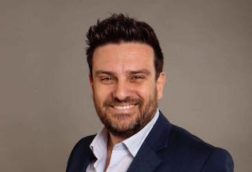

Nato a Milano il 21 luglio 1972.

Sono felicemente convivente con Giovanna dal 2001 e abbiamo 2 figli: Elisa di 9'anni e Filippo di 3.
Di professione avvocato, ho sempre fatto volontariato; per 15 in Croce Rossa a Desio dove sono stato vice responsabile dei volontari e poi Presidente del comitato Locale.
Mai stato iscritto ad un partito, mi sono avvicinato alla politica con la lista civica desio 2000 di Giampiero Mariani; da lui ho sicuramente preso lo spirito di servizio per la gente, lui era una persona disponibile all'ascolto è sempre presente in ogni circostanza. Come uomo l'ho sempre stimato e tutti noi che sono stati suoi "alunni" gli abbiamo sempre voluto bene.
Nel 2011 con altri amici abbiamo deciso di creare questa Lista Civica che oggi mi onoro di rappresentare quale candidato Sindaco.
Ho deciso di proseguire a fare politica a livello locale con una lista civica poiché è oggettivamente l'unico modo (sperando gli elettori vogliono metterci alla prova) di cambiare veramente e poter amministrare in tutta serenità senza l'incombenza dei partiti e delle loro dirigenze che tante priorità hanno tranne il benessere delle singole Città e dei loro cittadini.

## Lista Candidati

| Nome | Foto |
|-------|-------|
| andrea civiero | 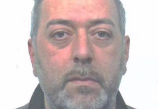 |
| barbara claudia ghezzi | 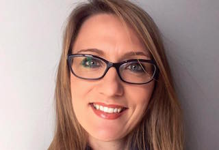 |
| chiara riva | 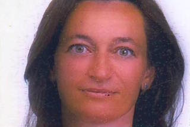 |
| donatella sala | 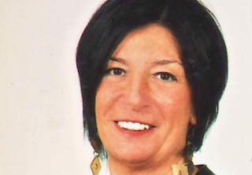 |
| elena tincati | 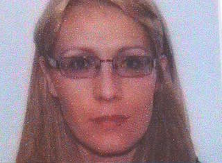 |
| gianluca zanelotto | 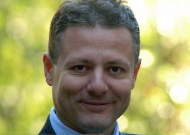 |
| gianni secchi | 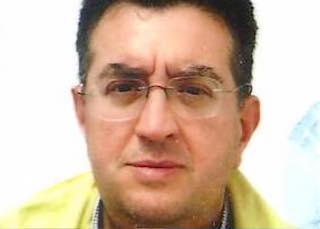 |
| giorgio rampi | 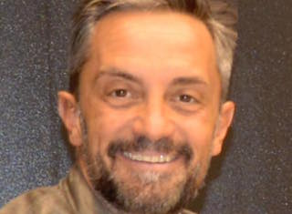 |
| laura gaiani | 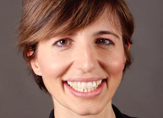 |
| laura lucidera |  |
| luca brioschi | 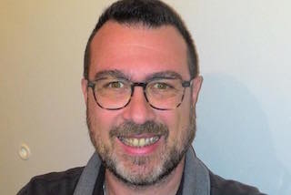 |
| luca rampi | 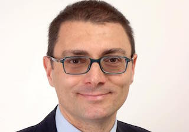 |
| luisa villa detta luisella | 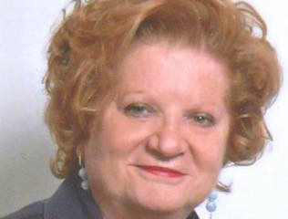 |
| margherita burgio | 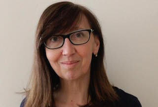 |
| paolo gelosa | 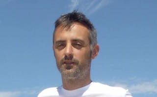 |
| paolo perrella | 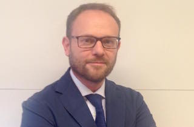 |
| roberto guenzati | 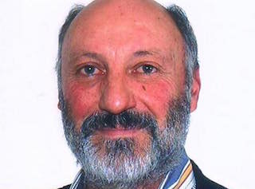 |
| simone biscaro | 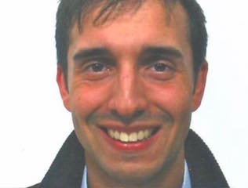 |
| simone valtorta | 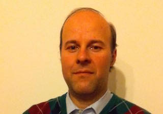 |
| valerio barbirato |  |

### ANDREA CIVIERO

Nato a Carate B.za il 30/01/76
Ottico, sposato, due figli.

### BARBARA CLAUDIA GHEZZI

Nata a Milano il 3.4.1972

### CHIARA RIVA

Nata a Desio il 26.10.1967

### DONATELLA SALA

Nata a Monza il 26/08/1967

Impiegata in una storica azienda desiana con mansioni amministrative.
Mi dedico da anni al volontariato. 
Mi sono impegnata nella lista civica perché da desiana vorrei che desio voltasse pagina con voglia di fare spendendosi PER la città e NON per personali mire politiche.

### ELENA TINCATI

Nata a Desio il 10.1.1968

### GIANLUCA ZANELOTTO

Nato a Milano il 16.7.1967

### GIANNI SECCHI

Nato a Desio il 9.4.1964

### GIORGIO RAMPI

nato a Desio il 02/01/1971

Diplomato (ITC) al Collegio PIO XI di Desio e Laureato (Scienze Politiche e gestione delle Aziende) all'Università Cattolica del Sacro Cuore.
Professione: Consulente settore "Commerciale e Marketing Internazionale" 

Convivente, ho un figlio di 7 anni

Passioni: da sempre sportivo (basket agonistico a Desio, Dive Master subacquea, Maratoneta amatoriale) e motociclista da sempre. 

Ho deciso di entrare nella Lista Civica Per Desio perché deluso dall'attuale amministrazione e dalla politica dei partiti. Amo la mia città e ritengo, insieme agli altri membri della Lista, di avere idee e volontà perché Desio possa tornare ad essere bella ed essere un riferimento tra le città della Brianza...una città dove sia bello vivere

### LAURA GAIANI

Nata a Desio il 26.11.1973

### LAURA LUCIDERA

nata a Desio Il 17/10/1967 

sposata, con 2 figli Andrea e Jessica professione: assistente socio sanitario presso gli anziani ,svolgo il mio lavoro con tanto amore.
Ho scelto di aderire a questo progetto perché ho il desiderio che Desio possa cambiare, in meglio certamento con la collaborazione di tutti.

### LUCA BRIOSCHI

Nato a Desio il 30.10.1974

Sposato, tre figli commerciante volontario da 23 anni nella Croce Rossa italiana.

### LUCA RAMPI

Nato a Milano il 7.6.1966
Avvocato
Sposato, 2 figli

### LUISA VILLA detta LUISELLA

Nata a Desio il 03 agosto 1951 

Coniugata, 1 figlio. 
Coordinatrice della Scuola dell'infanzia Sacro Cuore.
Sto con la Lista Civica PER Desio perché occuparsi SOLO di DESIO, sento sia diventata una indispensabile ragione per farlo

### MARGHERITA BURGIO

Nata a Desio il 16.3.1963

Coniugata, con 3 figlie
laureata
casalinga
Ho aderito per dare una mano e soprattutto una testa intelligente e seria alla nostra città.

### PAOLO GELOSA

Nato a Milano il 18.10.1975

### PAOLO PERRELLA

Nato a Monza il 26.2.1966

50 anni sposato 1 figlio, dirigente d'azienda.
Ho aderito alla lista civica perchè non voglio più soltanto lamentarmi e firmare deleghe in bianco ai partiti ma dare un contributo in prima persona.

### ROBERTO GUENZATI

nato a Desio il 18.9.1954

Coniugato, 1 figlia
Operaio 
Motivo iscrizione lista civica: unica alternativa per provare a cambiare Desio

### SIMONE BISCARO

Nato a Desio il 18.5.1988

### SIMONE VALTORTA

Nato a Desio il 18 giugno 1974. 

Laureato in Lettere Moderne (indirizzo Storico-Medievale) all’Università Cattolica di Milano con la tesi Amico e Amelio nell’agiografia medievale il 3 ottobre 2006; il 15 dicembre 2012 ho conseguito una seconda laurea, in Scienze Religiose (indirizzo Pedagogico-Didattico) presso l’Istituto Superiore di Scienze Religiose di Milano, con una tesi su La nozione cristiana di creazione.

Attualmente sono insegnante di sostegno presso una Scuola Primaria di Paderno 

Ho pubblicato i libri per bambini Il giullare di Dio (Edizioni dell’Immacolata, 2004, ristampato nel 2010), Il sorriso di una Madre (Edizioni dell’Immacolata, 2005), I racconti del saggio gufo (La Riflessione, 2008), Nonno, mi racconti la Bibbia? (Gruppo Editore L’Espresso, 2014, ristampato lo stesso anno) e il romanzo per ragazzi La spada nella roccia (Gruppo Editore L’Espresso, 2008).

Dal 2010 sono co-direttore del sito di approfondimento storico www.storico.org, per il quale ho pubblicato oltre 150 articoli.

Ho deciso di iscrivermi alla Lista Civica per Desio perché amo la città in cui sono nato e in cui vivo, e desidero dare la mia esperienza ed il mio contributo perché possa divenire un luogo piacevole in cui vivere e in cui fare cultura.

### VALERIO BARBIRATO

Nato a Desio il 25.6.1976

## Programma

### 1. SICUREZZA E LEGALITA’

1. La sicurezza è e deve essere una priorità dell’amministrazione di una Città come Desio affinché i cittadini e le loro famiglie possano ritornare a vivere appieno Desio in tutta serenità. Questa è un’esigenza che la cittadinanza ha percepito come fortemente trascurata dall’amministrazione fino ad oggi in carica;
2. la sicurezza può essere raggiunta con una concreta opera di prevenzione e con un effettivo presidio e controllo del territorio, attività principalmente di competenza delle forze della Polizia Locale che rivestono un ruolo fondamentale;
3. al fine di valorizzare ed incentivare l’importante lavoro già svolto dalla Polizia Locale, occorrerà: A) dare maggiore stabilità al corpo di polizia con la designazione di un nuovo comandante (ruolo attualmente scoperto nell’organigramma) con assunzione a tempo determinato secondo obiettivi; B) effettuare adeguati investimenti al fine di dotare le locali forze di polizia di moderni strumenti così che possano svolgere il loro lavoro in modo ancor più professionale e soddisfacente; C) istituire gradualmente il 3° turno (cominciando a coprire alcune sere per poi farlo diventare stabile, data la necessità di valutare l'organico e i servizi ad oggi resi); D) sgravare gli agenti di polizia locale, per quanto possibile, da servizi per i quali non è fondamentale la loro presenza o comunque non è richiesta una presenza significativa. Per il servizio scuole, a titolo esemplificativo, ci si potrà affidare, come oramai accade in tantissimi comuni italiani, ai “nonni civici”. Anche per le manifestazioni pubbliche e/o gare sportive, si potrà aumentare la collaborazione con le associazioni quali quella dei carabinieri in congedo e degli gli Alpini e con la Protezione Civile, che già svolgono già un ruolo importantissimo sul territorio. Si valuterà l’opportunità di allocare personale ordinario amministrativo presso il comando di polizia locale con assegnazione a mansioni di lavoro d’ufficio (il tutto rispettando ovviamente le mansioni ed i livelli dei dipendenti);
4. istallazione di ulteriori telecamere di sorveglianza, in particolare nelle zone più isolate e nelle aree a verde, con personale addetto al controllo effettivo e “in diretta” dei relativi monitor, al fine di non rendere sostanzialmente inutile la presenza delle telecamere stesse;
5. dotazione di colonnine SOS collegate direttamente con le sedi delle Forze dell’ordine (valutando i costi dell’installazione e coinvolgendo all’occorrenza soggetti privati con attività di found raising);
6. in vista della eventuale realizzazione della metrotramvia, valutazione di riapertura dei due “vecchi” sottopassaggi presenti sulla via Milano all'altezza delle scuole Pirotta e del mercato nord (recuperando così ore dedicate dagli agenti al servizio di “attraversamento strade” e finalizzarle allo svolgimento del terzo turno serale);
7. potenziamento del sistema di illuminazione esistente, con utilizzo di moderne tecnologie più performanti, eco-compatibili e che comportino un risparmio di spesa;
8. nomadismo: applicazione rigorosa dei regolamenti regionali e del regolamento di Polizia Locale;
9. reinserimento dell’educazione civica nelle scuole poiché solo partendo dall'infanzia si possano dare gli insegnamenti giusti per crescere dei cittadini consapevoli;
10. promozione di convegni e progetti scolastici nei vari gradi di istruzione con tema la legalità;
11. attenzione al ruolo della Protezione Civile e adeguamento degli strumenti a sua disposizione.

### 2. BILANCIO, FISCALITA’, PATRIMONIO, ORGANIZZAZIONE

1. Avviare un processo, necessariamente di medio-lungo termine (ma qualcuno deve pur cominciare), di revisione e RIVOLUZIONE della struttura della spesa con l’obiettivo di ridurre la spesa corrente e per la macchina burocratica, aumentando gli investimenti per garantire infrastrutture e servizi efficienti per i cittadini.
2. Utilizzare la maggiore flessibilità consentita dalle modifiche attuali e future del Patto di Stabilità solo per gli investimenti.
3. Attuare il "VERO Bilancio partecipato": spiegare in modo semplice a cittadini e associazioni (imprenditoriali, terzo settore, ecc) le voci di entrata e di spesa del bilancio comunale e identificare con il loro contributo una nuova lista di priorità sentite dai cittadini.
4. Censire accuratamente il patrimonio comunale per verificarne lo stato, l’efficienza (p.es. energetica per gli edifici) e la capacità di generare reddito e per prendere decisioni sulla possibile cessione o valorizzazione in altro modo. In questo contesto sarà necessario anche un focus specifico sulle partecipazioni e sugli immobili di proprietà del Comune (per la cessione o la destinazione a finalità sociali).
5. Analisi della spesa sociale per ridiscutere le priorità ed affrontare le reali emergenze.
6. Uso della leva fiscale (oltre che dei piani di investimento sopra citati) per favorire lo sviluppo del commercio, le nuove iniziative imprenditoriali, soprattutto giovanili, e il rinnovamento del centro storico con la ristrutturazione degli edifici privati.
7. Proseguimento degli sforzi per ridurre l’evasione e per il recupero dei crediti.
8. Presidio dei bandi per l’erogazione di fondi Europei, nazionali e regionali, da destinare ad iniziative che consentano di migliorare la dotazione infrastrutturale e la qualità dei servizi.
9. Analisi individuale delle competenze del personale del Comune con l’obiettivo di:

  - garantire il miglior uso possibile delle risorse esistenti;
  - favorire lo sviluppo delle professionalità;
  - impiegare al meglio le risorse, coprendo le esigenze effettivamente sentite dai cittadini e riequilibrando le strutture sovradimensionate (concordando con i sindacati le iniziative di rotazione degli incarichi e le eventuali mobilità anche tra diverse amministrazioni);
  - ridurre al minimo l’uso delle consulenze, quando le strutture e le competenze interne già esistono.

10. Semplificazione delle procedure per imprese e cittadini, anche attraverso gli “sportelli unici”, gli investimenti nei sistemi informativi e nell’integrazione di reti e database.
11. La pressione fiscale ha raggiunto i livelli storicamente più alti nel 2015. La fiscalità andrà ripensata anche alla luce della recente abolizione della TASI sulla prima casa. I principi di base, da applicare in un’ottica di medio termine e parallelamente alla riduzione della spesa corrente, saranno comunque: contenimento della pressione sulle famiglie con figli; uso della leva fiscale per agevolare le nuove iniziative imprenditoriali/commerciali (con particolare attenzione all’imprenditorialità giovanile) ed investimenti per ammodernare e recuperare il patrimonio immobiliare privato.

### 3. EDILIZIA, GOVERNO DEL TERRITORIO E MOBILITA’

Obiettivo generale è realizzare una pianificazione e progettazione della nuova città con una maggiore partecipazione dei cittadini coinvolgendoli nei piccoli/grandi obiettivi (come, ad esempio, la viabilità nel centro storico ed il recupero degli edifici pubblici da restituire alla città con nuove funzioni condivise dai cittadini), organizzando concorsi di idee di architettura, per avvicinarsi agli esempi delle città virtuose vivibili ed inclusive, valorizzando le forze sociali e l'energia culturale della società civile. Sarà per esempio possibile istituire concorsi anche nazionali al fine di studiare il reinserimento nel tessuto vitale della città di aree al momento dismesse, ma di grande valore strategico (area ex- ospedale, scuola ex ITIS), con funzioni di carattere sia pubblico che privato e che si autofinanzino, senza diventare un peso per la cittadinanza.

Finalità da perseguire:

1. limitare il consumo di territorio e delle aree ancora edificabili, con l’obbiettivo di contenere la popolazione entro i 43.000 abitanti;
2. reinterpretare il concetto, introdotto dalla Legge sul Governo del Territorio, di scambio e compravendita delle volumetrie generate dalle aree non edificabili, che attualmente blocca sia economicamente che operativamente, le operazioni immobiliari sul territorio;
3. favorire gli interventi di recupero e riuso del patrimonio edilizio esistente (piccoli ampliamenti, ristrutturazione, recupero del sottotetto), dotando i cittadini e gli operatori del settore, di nuovi strumenti che, in linea con le normative regionali e nazionali, consentano interventi di incentivazione anche tramite premi volumetrici e agevolazioni sugli oneri di urbanizzazione, volti a migliorare il tessuto urbano consolidato e l’immagine della città;
4. migliorare il dialogo tra ente pubblico e soggetto privato, con lo scopo di conciliare i rispettivi interessi, semplificando le procedure;
5. revisione e stesura di un nuovo regolamento edilizio che preveda chiare indicazioni sulle modalità di progettazione della città, mediante uno studio tipologico delle caratteristiche edilizie peculiari zona per zona e suggerimenti di composizione architettonica sulle possibilità di intervento (elaborazione di un piano colore);
6. mantenimento della destinazione urbanistica dell’area della Casa di Riposo “Pio e Ninetta Gavazzi” di corso Italia esclusivamente per servizi socio-sanitari dedicati in primo luogo gli anziani;
7. istituzione di “tavoli di lavoro” pubblico-privato per l’identificazione di soluzioni per il recupero delle aree dismesse e degli edifici non completati. In particolare, con riferimento al grattacielo insistente sull’area PTB, si intende sollecitare attivamente l’intervento di fondi immobiliari specializzati in housing sociale e residenze per studenti universitari al fine di reperire le risorse per il completamento dell’opera e la sua destinazione alle finalità sopra citate, con coinvolgimento anche dei comuni confinanti eventualmente interessati al progetto;
8. incentivazione, per chi realizza nuovi edifici, dell’adozione delle più moderne metodologie costruttive idonee a collocare questi edifici in classe energetica A e che valorizzino -anche dal punto di vista architettonico ed urbanistico- la città (a tale scopo sarà necessario fornire agli operatori del settore, linee guida generali in merito alle tipologie costruttive, indicazioni interpretative delle norme tecniche e sui pareri della Commissione Edilizia e della Commissione Urbanistica);
9. completamento del sistema di tangenziali per decongestionare il traffico in centro;
10. studio di soluzioni viabilistiche e progetti per il decongestionamento degli svincoli da e verso la superstrada Milano-Lecco;.
11. Pedemontana: si tratta di un’opera di interesse nazionale. L’Amministrazione Comunale può intervenire al fine di ridurre l’impatto sul territorio di Desio e sulla viabilità indotta, sollecitando la realizzazione di tutte le opere di compensazione necessarie
12. Metrotranvia: sollecitare tutti gli Enti coinvolti a un radicale ripensamento o riprogettazione di un’infrastruttura i cui benefici non sono del tutto evidenti se rapportati al costo e all’impatto sulla viabilità cittadina
13. attuazione e completamento del sistema di piste ciclabili, unito ad una costante manutenzione dell’esistente
14. piano scuola ed edifici pubblici: valutazione dell'involucro edilizio (come è costruita la struttura della scuola) da parte di un professionista abilitato per un futuro efficientamento energetico con l'utilizzo di materiali eco-sostenibili e tecnologie innovative. E' infatti possibile ridurre di almeno il 10% le spese di gestione della scuola puntando sull'ottimizzazione e l'utilizzo di sistemi atti a renderla scuola più “risparmiosa”. Organizzazione degli istituti scolastici al fine di accedere a fondi Governativi per l'efficienza energetica;
15. incentivazione della raccolta differenziata dei rifiuti;
16. acqua: utilizzo di riduttori di portata nei rubinetti, recupero dell'acqua piovana per scopi ove non vi è la necessità di utilizzare acqua potabile (irrigazione – cassette di scarico ecc.);
17. energia: utilizzo di sistemi a “cappotto” per migliorare la struttura degli edifici pubblici, utilizzo della tecnologia Led per l'illuminazione delle aree di pertinenza, teleriscaldamento e utilizzo di valvole termostatiche per i caloriferi ecc.;
18.attuazione di un progetto didattico teorico/pratico per studenti e insegnanti legato al risparmio quotidiano di energia per il riscaldamento/raffrescamento e illuminazione;
19. efficientamento energetico negli edifici pubblici da estendere gradualmente a tutta la città, accompagnando e sostenendo il privato cittadino nella riqualificazione energetica della sua abitazione;
20. attivazione di uno sportello gratuito a cui tutti i cittadini possono far riferimento per conoscere le modalità utili a migliorare la propria abitazione rendendola più salubre e eco-sostenibile.

### 4. URBANISTICA E COMMERCIO

1. attuazione di un progetto di riqualificazione del centro e dell’asse di Via Garibaldi, che porti, mediante il rifacimento progressivo della pavimentazione, dell’eliminazione dei binari del “vecchio” tram e a una politica mirata di reintroduzione di attività commerciali, a costituire una zona pedonale/ciclabile;
2. elaborazione del “Piano del Commercio” per valorizzare il centro storico con una organica rielaborazione della dislocazione dei parcheggi pubblici al servizio della Città, con particolare attenzione a quelli dislocati intorno al nucleo di antica formazione;
3. rivalutazione totale dell’asse commerciale via Garibaldi - C.so Italia – via Matteotti - via Lampugnani tramite rialzo sede stradale a piano marciapiede, p.es. costituendo una ZTL con diritto pedonale e con colonnine autovelox piazzate in angoli strategici (limite velocità max 30 km/h), e consentendo il libero accesso ai veicoli che intendono recarsi in centro, ma disincentivando il traffico da attraversamento;
4. copertura totale tramite asfalto di tutto l’asse tramviario;
5. revisione complessiva della situazione delle barriere architettoniche di ogni genere in tutto il territorio comunale, partendo dagli edifici pubblici;
6. creazione di percorsi guidati e ben illuminati che raccordino l’asse centrale ai parcheggi esterni al centro (Piazzale mercato, Coop, Asl, P.zza Don Giussani); messa in sicurezza delle vie che conducono ai parcheggi, come via Borghetto e via Grandi; ristrutturazione della tettoia ex-Gavazzi e sua destinazione a rimessa per biciclette private e “pubbliche” e a punto di partenza per percorsi pedonali e ciclabili verso il centro storico;
7. arredo urbano degno di una citta’ come la nostra, installazione di panchine, illuminazione adeguata , cestini con posaceneri, fioriere, filodiffusione lungo l’asse commerciale;
8. realizzazione di un programma completo di cura del verde da parte di soggetti professionali e destinazione di risorse economiche adeguate agli obiettivi che ci si prefigge di raggiungere;
9. Wifi gratuito in aree di interesse pubblico;
10. completa revisione del sistema di illuminazione di sedi stradali e marciapiedi, tale da garantire la sicurezza (vedi sopra) anche nelle ore serali
11. incentivi alle attività commerciali per la ristrutturazione dei negozi.
12. incentivi a bar e ristoranti per far posizionare fuori dal locale tavoli e sedie, modulando la tassa di occupazione suolo pubblico.
13. incentivi a chi apre una nuova attività commerciale, come sgravi fiscali per i primi anni;
14. manifestazioni da ideare e realizzare insieme ai commercianti per promuovere le varie attività
15. identificazione di opportuni interventi di “rivitalizzazione” dei quartieri periferici che incentivino la formazione di piccole ‘isole commerciali’
16. incentivi alla creazione di una “zona della movida” in aree periferiche dove già ci sono locali di successo, collegando queste aree alle zone residenziali con
percorsi sicuri ed illuminati e rendendole adeguatamente attrezzate.

### 5. POLITICHE SOCIALI

1. I principi fondamentali sui quali improntare le politiche sociali sono per noi:

  A) identificazione delle reali priorità e delle emergenze;
  
  B) utilizzazione le risorse in maniera mirata e con il massimo dell’efficienza;
  
  C) coinvolgimento “in rete” del cosiddetto terzo settore (le associazioni di volontariato hanno infatt9i sempre dimostrato di saper rispondere in maniera adeguata ai bisogni sociali).

2. Per le persone diversamente abili: necessità di una precisa mappatura delle situazioni esistenti e identificazione delle esigenze più urgenti e del tipo di interventi necessari, consentendo un impiego mirato delle risorse e una risposta adeguata alle famiglie in maggiore difficoltà;
3. sostegno nel percorso scolastico di alunni diversamente abili a partire dalla scuola dell’infanzia con interventi educativi per un numero di monte ore adeguato al monte ore settimanale frequentato dall’alunno;
4. sostegno alla famiglia, fondamentale nucleo sociale, e attenzione alle sue necessità (il numero sempre crescente di richieste di iscrizione presso le scuole dell’infanzia richiede un’attenta valutazione di un investimento per l’attivazione di nuove sezioni di scuola materna e di un nuovo asilo nido); incentivazione di momenti di incontro e confronto soprattutto tra le coppie giovani, con realizzazione di spazi informativi ed educativi nonché ludici per i loro bambini;
5. progettazione, promozione e coordinamento di attività in favore di famiglia e minori anche in materia di adozioni, affidamento familiare, contrasto ad abusi e maltrattamenti nell’infanzia, diritti ed opportunità dell’infanzia e dell’adolescenza;
6. anziani: recupero, riqualificazione e rilancio della storica sede della Casa Di Riposo “Pio e Ninetta Gavazzi” (con recupero dei posti letto accreditati dalla Regione Lombardia), con realizzazione di un centro di riabilitazione con camere per lunga degenza dopo interventi chirurgici, palestra per fisioterapia post trauma, ambulatori e anche dei mini alloggi per anziani autosufficienti in difficoltà, nonché sviluppo di servizi a loro indirizzati.
7. promozione di iniziative volte alla educazione e alla responsabilizzazione dei giovani in età adolescenziale, al fine di difenderli dai pericoli che ogni giorno minano la loro serenità loro e quella delle loro famiglie (bullismo, droga, alcool ecc.);
8. identificazione di aree ed edifici pubblici da destinare ad iniziative di gruppi giovanili;
9. iniziative dedicate alla promozione e al sostegno di progetti di “housing” sociale;
10. attuazione di servizi finalizzati a facilitare l’inserimento nel tessuto cittadino degli stranieri legalmente soggiornanti sul territorio italiano;
11.iniziative dedicate ad agevolare i contatti fra le aziende del territorio e i cittadini in cerca di occupazione, attivazione di borse di studio e corsi al fine di facilitare il primo ingresso per i giovani o la reintroduzione delle persone adulte nel mondo del lavoro;
12. individuazione di soluzioni che, nei termini consentiti dalle normative vigenti, agevolino, nella concessione di aiuti sociali (contributi, case comunali, detrazioni, ecc.) coloro che risultano risiedere da più tempo in Città;
13. promozione da parte dei servizi sociali dell’integrazione delle politiche sociali con quelle degli altri settori (politiche del lavoro, della casa, della formazione professionale, dell’istruzione e della pianificazione territoriale);
14. sostegno alle associazioni presenti sul territorio che contribuiscono a migliorare la qualità della vita dei cittadini;
15. politiche a tutela delle pari opportunità;
16. istituzione di una figura di coordinamento con le associazioni del settore al fine di redigere un elenco monitorato e aggiornato dei cittadini certificati per l'utilizzo dei defibrillatori, il numero e il posizionamento degli apparecchi stessi, affidandone incarico alla Croce Rossa Italiana (eccellenza da anni sul territorio) così da disporre di un soggetto di riferimento certo e qualificato; il tutto per rendere Desio un punto di riferimento tra le città "cardioprotette";
17. pianificazione di corsi di primo soccorso e di educazione sanitaria in modo continuativo in modo da creare una solida cultura in tal senso.

### 6. CULTURA

1. Realizzazione di eventi culturali finalizzati alla promozione di una «coscienza di comunità» e organizzazione di eventi per i Desiani con le risorse umane dei Desiani, che ci sono e che devono essere valorizzate;
2. collaborazione con le associazioni cittadine culturalmente attive, promuovendo la creazione di eventi di qualità a costi il più possibile contenuti, coordinandone il calendario (evitando periodi “morti”) e destinando, con priorità chiare e non “a pioggia”, le risorse di bilancio; sostegno (anche economico) alle associazioni culturalmente attive sulla base di tre parametri di eguale importanza: A) numero degli eventi culturali proposti e realizzati; B) qualità culturale di ogni evento; C) capacità in occasione degli eventi di aggregare intorno a sé parte della cittadinanza;
3. pubblicizzazione delle proposte culturali sia con i mezzi informatici sia con mezzi più tradizionali;
4. organizzazione e promozione della partecipazione a concerti dal vivo e visite a mostre e luoghi d’arte;
5. organizzazione di una rassegna di spettacoli teatrali all’aperto nella suggestiva cornice di Villa Tittoni (in estate);
6. organizzazione ad inizio autunno, in Villa Tittoni, del «Festival per i bambini» in occasione del quale le associazioni culturali cittadine potranno organizzazione eventi per i più piccoli, come la lettura di favole, la presentazione di brani musicali adeguati, la preparazione di uno spettacolo teatrale, l’apprestamento di un laboratorio di pittura creativa ecc.;.
7. promozione ed organizzazione di eventi, mostre, conferenze ed incontri di carattere culturale nella sala delle colonne in Villa Tittoni;
8. coordinamentodelleiniziativeperilrecuperourbanisticoeperilrilanciodelle attività commerciali con quelle finalizzate al recupero ed alla valorizzazione del patrimonio storico e culturale della Città di Desio (basti ricordare la Villa Tittoni-Traversi, il museo Scalvini, la Basilica con annessa torre campanaria, la Casa Natale di Pio XI, il Santuario del Sacro Crocifisso, la Torre del Palagi, il Museo della Miniera ecc.);
9. ideazione e realizzazione di percorsi guidati e integrati con la realtà cittadina che rendano interessante e divertente conoscere Desio, anche per i suoi cittadini;
10. utilizzo della Villa Tittoni-Traversi, ai fini di una sua valorizzazione, ad eventi adeguati al suo contesto;
11. riproposizione della “Stagione estiva del Cinema” e di spettacoli teatrali, concerti jazz o di musica classica in Villa (ed individuazione di altre aree/strutture più idonee per i concerti pop/rock ecc.);
12. “Casa Natale di Papa Ratti”: recupero, in collaborazione con la Regione Lombardia, del progetto di realizzazione di una rete di iniziative e di un programma con i comuni di Sotto il Monte (città natale di Giovanni XXIII) e Concesio (città natale di Paolo VI) che valorizzino i tre grandi Papi Lombardi del ‘900;
13. «La Desio dei nostri nonni»: ad inizio primavera le sale di Villa Tittoni saranno dedicate alla Desio del secondo dopoguerra con l’esposizione di fotografie, dipinti, scritti, oggetti d’uso quotidiano, una sorta di piccolo museo per accompagnare i bambini alla scoperta di com’era la loro città quando i nonni avevano la loro stessa età. Si potranno organizzare visite guidate per le scuole.
14. altri eventi potranno essere organizzati in occasione di particolari festività civili o religiose (Halloween/Ognissanti, S. Natale, Palio degli Zoccoli...).

### 7. SPORT

1. Necessità di una visione d’insieme, ampia e completa, che includa ogni attività sportiva svolta sul territorio, sia a livello amatoriale che agonistico, e creazione di un ambiente fertile e adeguato al suo svolgimento;
2. attivazione di un “Collegio organizzativo per lo Sport” che possa sviluppare la rete connettiva tra associazioni sportive, organi come il CONI ed il CSI, le Federazioni Sportive e che dovrà: A) considerare le problematiche legate allo sport per i disabili sia nelle strutture dedicate che nella stessa città (leggasi abbattimento delle barriere architettoniche); B) sviluppare progetti ed eventi utili ad avvicinare le persone allo sport e farlo crescere sul territorio (il tutto dovrà essere fatto tenendo sempre in considerazione il rapporto tra costi e benefici affinché le risorse non vadano sprecate);
3. valutazione da parte dell’Amministrazione, secondo le indicazioni del collegio, di come adeguare, potenziare, migliorare, rinnovare o costruire ex novo le strutture sportive, attivandosi nella ricerca di finanziamenti sia pubblici che privati;
4. accertamento della reale ed efficace pratica dello sport nelle scuole e della promozione dei propri valori e delle reali possibilità di accesso allo sport da parte di persone diversamente abili;
5. realizzazione in varie aree “strategiche” della città di spazi dedicati agli sport outdoor praticati dai giovani, che fungano da punti di aggregazione e a loro volta incentivino l’apertura di attività di ristorazione, con particolare attenzione alle aree periferiche della città affinché i residenti nei vari quartieri possano giovare della pratica sportiva/aggregativa (insieme all’utilizzo delle aree verdi dedicate alle famiglie ed i parchi gioco per bambini). Queste aree sono fondamentali per ritrovare in ogni quartiere il senso di appartenenza, coesione sociale ed integrazione. Le stesse saranno funzionali solo ed esclusivamente se collegate tra loro attraverso una rete di piste ciclabili/marciapiedi affinché giovani e famiglie possano spostarsi tra quartieri e/o verso il centro, in piena sicurezza, anche la sera (grazie ad adeguata illuminazione e attraversamenti pedonali sicuri) e senza far uso di autovettura;
6. tale rete formerà allo stesso tempo una serie di circuiti di vari chilometraggi, fruibili anche da chi pratica la corsa a piedi, e che potrebbero fare capo al “Campo Sportivo Comunale” (che insieme alla Piscina ed al Palazzetto dello Sport formeranno un vero e proprio polo sportivo) dove, oltre all’ampio parcheggio, esisterebbe il servizio delle docce (a pagamento) nonché la possibilità di utilizzare la pista di atletica (sempre a pagamento). Tali somme sarebbero destinate alla manutenzione delle strutture di atletica che oggi sono in pessimo stato. L’uso sportivo delle piste ciclabili nei vari orari avrà positivi risvolti anche nel contesto della sicurezza per chi percorre queste in orari serali;
7. coinvolgimento del centro della città e delle attività commerciali, realizzazione di eventi sull’asse centrale C.so Italia/Via Garibaldi (usufruendo anche di spazi ampi come Piazza Conciliazione o Piazza Don Giussani) così da portare la cittadinanza a vivere la città e farla vivere a sua volta;
8. promozione di competizioni ed manifestazioni sportive non competitive e comunque di eventi utili, anche al fine di pubblicizzare le società sportive presenti sul territorio, sia “una tantum” che periodicamente, anche coordinate con eventi di altra natura (come i mercoledì sera estivi).

## Fonte

[Post Facebook](https://www.facebook.com/media/set/?set=a.605400952961345.1073741833.316836751817768&type=3)
