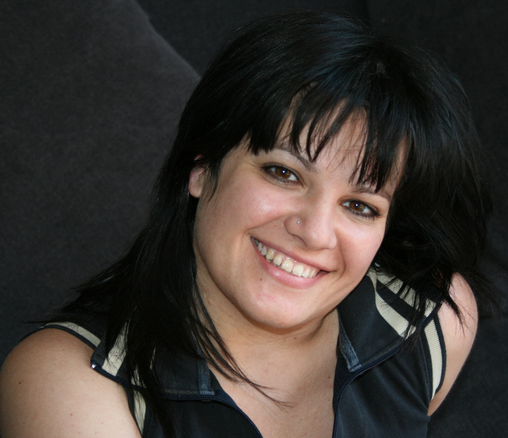
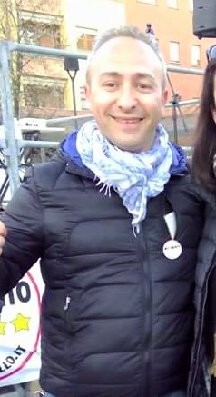
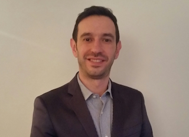
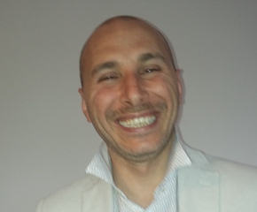
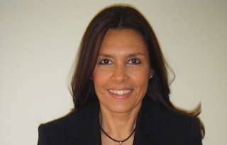
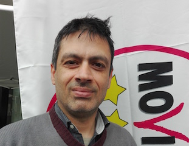
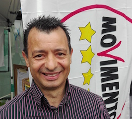
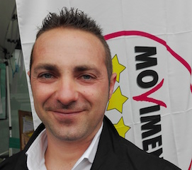

# Movimento 5 Stelle

[Candidato Sindaco](#sara-montrasio-candidato-sindaco)
[Lista Candidati](#lista-candidati)
[Biografie Candidati](#biografie-candidati)
[Programma](#programma)
[Link e Risorse](#link-e-risorse)

## Sara Montrasio (candidato sindaco)

[Facebook](https://www.facebook.com/montrasiodesio)

### Intervista 1

**Quali priorità per la città?Sara Montrasio**

> «C’è una serie di cose sulle quali ci possiamo attivare da subito: rendere gratuiti i parcheggi ai disabili, visto che ora sulle strisce blu sono costretti a pagare. Scegliere almeno un intervento per quartiere tra quelli che i cittadini riterranno più opportuni, piccole cose che diano già un esempio del lavoro più ampio che vorremmo fare. Ultimo, ma non per importanza: avviare subito lo studio epidemiologico sugli effetti del forno inceneritore sulla salute dei cittadini. È il terreno su cui il Movimento 5 Stelle di Desio è nato e si batte da sempre: dalla gestione pulita dei rifiuti, senza incenerimento, allo stop a Pedemontana. Non è ideologia: vogliamo vivere in un ambiente più pulito per difendere la salute di tutti. La prima cosa da fare su questo punto sarà, appunto, avviare lo studio epidemiologico nelle zone interessate dalla ricaduta dei fumi dell’inceneritore. Studio che abbiamo fortemente voluto e per la cui realizzazione ci siamo impegnati in consiglio comunale indirizzando con i nostri atti l’attuale amministrazione. Perché diciamo no all’incenerimento? Perché è pericoloso per la salute e inefficiente economicamente».

**Quale sarebbe il suo primo atto da sindaco?**

> «Un piccolo progetto per ogni quartiere, concordato con i cittadini, come detto. E contemporaneamente proporrei la modifica del regolamento del consiglio comunale per renderlo più produttivo».

**Perché i cittadini dovrebbero votarla?**

> «Perché il Movimento 5 Stelle ha le mani libere. Gli unici finanziatori che abbiamo sono le nostre tasche e i cittadini che ci sostengono con le loro libere offerte. E i cittadini sono gli unici a cui rispondiamo».

[Fonte](http://www.ilgiorno.it/monza-brianza/desio-candidati-sindaco-1.2139136)

## Lista candidati

| Nome | Data di nascita | Biografia | Foto |
|------|-----------------|:---------:|:----:|
| Andrea Statzu | 11 aprile 70 | | |
| Attilio Morciano | 30 maggio 62 | | |
| Caterina La Malfa | 22 ottobre 74  | [:link:](#caterina-la-malfa) |  |
| Corrado Fossati | 5 ottobre 71 | | |
| Daniela Rainoldi | 6 gennaio 66  | [:link:](#daniela-rainoldi) | |
| Enrico Ainis | 5 maggio 78  | |  |
| Luca Gelosa | 4 gennaio 79 | [:link:](#luca-gelosa) |  |
| Luca Pace | 8 dicembre 76 |  [:link:](#luca-pace)|  |
| Magda Giannattasio | 6 settembre 53 | | |
| Marina Colombo | 15 agosto 60  | [:link:](#marina-colombo) |  |
| Marzia Carpanelli | 22 aprile 78 | | |
| Massimo Barbanti | 1 dicembre 70 | |  |
| Morris Arlati | 20 giugno 81  | [:link:](#morris-arlati) | |
| Oliviero Pelucchi | 18 dicembre 61  | | |
| Paola Peretto | 29 giugno 67 |  [:link:](#paola-peretto)| |
| Paolo Tiralongo | 24 ottobre 66  | [:link:](#paolo-tiralongo) |  |
| Pietro Silvia | 12 aprile 79  |  [:link:](#pietro-silvia)|  |
| Roberto Castellazzi | 6 dicembre 44 | | |
| Sonia Garofalo | 7 febbraio 81 | | | |

## Biografie candidati

### MORRIS ARLATI

**Chi sono**: Sposato e padre di un bimbo di 2 anni Abito a Desio dal 2010 Ho una Laurea magistrale in Scienze Economiche Aziendali, specializzazione in Legislazione delle Imprese Impiegato contabile, lavoro presso un studio professionale e mi occupo di procedure fallimentari.

**Per Desio desidero**: una città a portata di bambino, con qualche parco in più e migliorare quelli presenti, piste ciclabili che non finiscano nel nulla

il centro di Desio pedonale cercando di attrarre negozi anche con una politica di incentivi (sempre guardando il bilancio)
creare eventi e attrarre pubblico anche dai paesi limitro
attivare un servizio di trasporto pubblico per disincentivare l’uso dell’auto
sistemare le scuole e rivalutare i beni storici della nostra città, come Villa Tittoni

### CATERINA LA MALFA

**Chi sono**: Convivo e sono mamma di due bambini, di 2 e 7 anni

Abito a Desio da 10 anni
Ho studiato Giurisprudenza ma sono ancora “laureanda”
Sono una libera professionista, contabile.

**Per Desio desidero**: la sua rinascita! Mi piacerebbe incentivare lo sport, coinvolgendo giovani e meno giovani, mi piace dialogare e confrontarmi con la gente, vorrei che su tutti i tetti di Desio potessimo installare i pannelli fotovoltaici, vorrei far rivivere Desio con le idee di tutti e sfruttando ogni piccola risorsa che la città possiede, come le nostre due belle piazze. C’è tanto da fare a Desio, io posso promettere che il mio impegno sarà costante, perché Desio ha bisogno di tutti noi.

### LUCA GELOSA

**Chi sono**: impiegato, ho sempre lavorato nell’edilizia ma per via della crisi mi sono dovuto reinventare professionalmente. Padre di una bimba di due anni, per lei vorrei rendere Desio un luogo sicuro dove poter crescere. Ho molto a cuore la città: sono promotore di iniziative di volontariato. Sono Vicepresidente di un’associazione di promozione sociale, faccio parte del comitato del mio quartiere, del Controllo del Vicinato, del gruppo dei campanari della Basilica e sono consigliere della Casa di riposo.

**Per Desio desidero**: a rontare la disoccupazione: il lavoro è innanzitutto dignità e la dignità non dovrebbe essere negata a nessuno, far ri orire la nostra città per aiutare le piccole realtà commerciali e artigianali che sono il  ore all’occhiello del nostro territorio. Ma non solo. Creare nuovo lavoro promuovendo il Microcredito 5 Stelle.

### PAOLO TIRALONGO

**Chi sono**: siciliano, sposato da quasi 26 anni, ho un  glio di 24 e vivo a Desio da 10 anni. Ho sempre lavorato per aziende di autotrasporti come responsabile risorse umane e responsabile della logistica.

**Per Desio desidero**: più verde e meno cemento, riquali cazione degli immobili e più parchi attrezzati, sia per bambini che amici a 4 zampe. Priorità ai cittadini più bisognosi, sia sul lavoro che per la casa. Sicurezza e rispetto, sia dei propri beni che di quelli altrui. Ascoltare le persone che hanno problemi e aiutarle a risolverli. Aiutare gli immigrati a inserirsi nella comunità desiana coinvolgendoli
nel programma cittadino.

### MARINA COLOMBO

**Chi sono**: Avvocato settore civile-tributario con studio a Desio, sono stata Difensore Civico del Comune dal 2000 al 2005. Ho un  glio, Alessandro, laureato in Giurisprudenza. Sono stata “adottata” da Desio  n dai tempi del Liceo e poi mi ci sono trasferita e ho aperto il mio studio legale. Da Difensore Civico per cinque anni ho ricevuto i cittadini in Comune dove avevo un mio u cio. Ho partecipato come Difensore Civico a concorsi nazionali ricevendo anche un premio per un elaborato sui problemi della città. Ho promosso a Desio l’organizzazione di un convegno sull’entrata in vigore delll’Euro. Ho tenuto una rubrica sul quotidiano “Il Giorno” in materia di condomini.

**Per Desio desidero**: vorrei porre l’attenzione sulla sicurezza e sul rispetto della legalità, specie in questi momenti di gravissime tensioni e considerata la forte immigrazione avutasi in questi anni. Vorrei che si desse un’impronta urbanistica precisa che migliori l’aspetto cittadino e il verde pubblico, non solo quantitativamente ma qualitativamente.

### LUCA PACE

**Chi sono**: nato a Milano, residente a Desio dal 2006 con la mia famiglia, moglie e  glia che ora ha 6 anni. Diploma tecnico elettronico, lavoro da quasi venti anni in Trenitalia come tecnico controllo qualità e sicurezza del materiale rotabile. Donatore Avis dal 1995. Mi piace aiutare chi è più sfortunato di me, sono ottimista di natura, sempre attivo, non mi piace oziare, voglio sempre fare e curiosare. Attivista del Movimento 5 Stelle dal 2010 perché credo nella coerenza e nell’onestà.

**Per Desio desidero**: la partecipazione e la condivisone sono i miei ideali, vorrei fare semplicemente la mia parte da Cittadino Attivo per il bene comune, nessuna ricerca di consensi o poltrone, solo avere una città sempre più vivibile e apprezzata dai cittadini come me! OGNUNO DEVE FARE LA SUA PICCOLA PARTE

### PIETRO SILVIA

**Chi sono**: ho 37 anni, sono sposato e papà di tre figli.

Abito a Desio già da tanti anni, sono un artigiano edile con la passione del fai-da-te.

**Per Desio desidero**: che diventi una città nuova, una città aperta alle innovazioni, una città pulita e vivibile, con iniziative e attività che coinvolgano tutti i cittadini, qualcosa che sia a portata di famiglia. Desio deve ra orzare le attività commerciali che abbiamo e agevolare quelle nuove, non solo quelle che si a acciano sulle strade del centro. È inoltre necessaria una rete di trasporto pubblico e ciente, comoda e in linea con le richieste dei cittadini.

### PAOLA PERETTO

**Chi sono**: nata in provincia di Biella, abito a Desio dal 2007 con il mio compagno e nostra  glia di 9 anni. Dopo una lunga esperienza lavorativa in ambito contabile e amministrativo, ho deciso di mettermi in gioco come consulente. “Respiro” quotidianamente le di coltà che molte piccole imprese a rontano a causa della pressione  scale e di una crisi economica causata da scelte politiche che non le hanno tutelate. Questo e molti altri motivi mi hanno spinta a non  darmi più della “politica delle false promesse”. Sono una persona concreta. Attiva nel Movimento 5 Stelle dal 2009 e ancora prima nel “Comitato per l’alternativa all’inceneritore”.

**Per Desio desidero**: valorizzare le idee e le proposte dei cittadini. Mi piacerebbero luoghi d’incontro e aggregazione per bambini e ragazzi, una maggior valorizzazione dei luoghi d’interesse storico e culturale,  nalizzata anche a incrementare il commercio locale Vorrei poter contare su un sistema di sicurezza potenziato da telecamere (oltre che da una maggiore collaborazione tra cittadini).

### DANIELA RAINOLDI

**Chi sono**: cittadina desiana da generazioni e mamma di una ragazzo di 18 anni.

Laureata in lingue, lavoro come impiegata.

**Per Desio desidero**: il mio sogno è che Desio diventi una città a misura d’uomo, viva da un punto di vista culturale, sempre più verde e senza inceneritore. Una città dove bambini, ragazzi e anziani trovino gli spazi adatti alle loro esigenze, una città nella quale le istituzioni siano davvero al servizio dei cittadini.

## Programma

Mettere le idee in comune significa attingere a tutte le competenze, alle esperienze virtuose di altri comuni e a tutto ciò che, pur appartenendo a campi differenti dalla pubblica amministrazione, può servire a dare risposte alle diverse istanze dei desiani.

Per questo il nostro programma è stato scritto insieme ai cittadini, sia attraverso il confronto diretto sia, essendo noi stessi semplici cittadini, basandoci sulle nostre esperienze di tutti i giorni per trovare soluzioni innovative ai problemi e nuove idee per vivere meglio la città.

Saranno le nostre idee unite a quelle dei cittadini a costruire una città migliore per tutti.

### I NOSTRI VALORI

- Il cittadino al centro della vita politica e delle decisioni pubbliche
- La salute di tutti e la tutela dell’ambiente come bene comune irrinunciabile
- La trasparenza nella gestione della cosa pubblica e nei rapporti con i cittadini
- La democrazia diretta per coinvolgere tutti nelle decisioni 

- La rivalutazione delle competenze e dei meriti
- Il rispetto delle regole, il confronto, l’onestà
- Il perseguimento di condizioni di vita dignitose per tutti
- La corretta informazione
- Il rifiuto e la ferma condanna di ogni forma di violenza

### I NOSTRI CANDIDATI

- Non sono iscritti a nessun partito e non hanno svolto in precedenza più di un incarico amministrativo a qualsiasi livello
- Sono incensurati
- Si impegnano a dimettersi immediatamente qualora perdessero i requisiti richiesti

> NESSUNO DEVE RIMANERE INDIETRO

> NESSUNO DEVE RIMANERE SOLO

### AMBIENTE E SALUTE

È il terreno su cui il Movimento 5 Stelle di Desio è nato e si batte da sempre: dalla gestione pulita dei rifiuti, senza incenerimento, allo stop a Pedemontana. Non è ideologia: vogliamo vivere in un ambiente più pulito per difendere la salute di tutti.

La prima cosa da fare su questo punto sarà avviare lo studio epidemiologico nelle zone interessate dalla ricaduta dei fumi dell’inceneritore. Studio che abbiamo fortemente voluto e per la cui realizzazione ci siamo impegnati in consiglio comunale indirizzando con i nostri atti l’attuale amministrazione.

Perché diciamo no all’incenerimento? Perché è pericoloso per la salute e inefficiente economicamente. Consideriamo che la maggior parte dei rifiuti soldi urbani che ora finisce in discarica o nell’inceneritore è composta da materiali riciclabili e riutilizzabili. Occorre ripensare il nostro sistema di smaltimento rifiuti, puntando a un consistente aumento della raccolta differenziata grazie a buone pratiche come la tariffazione puntuale: più ricicli e differenzi, meno paghi. Il nostro modello esiste già! Il Consorzio Contarina, soggetto pubblico innovatore nello sviluppo e realizzazione di soluzioni per l’ambiente e per la tutela del territorio, che in provincia di Treviso ha abbattuto la produzione di rifiuto a soli 50kg l’anno per abitante e viaggia verso i 10Kg, superando il 90% di raccolta differenziata (mentre noi siamo a circa 130/140kg).

Dopo quasi dieci anni di impegno e contrasto all’inceneritore, chiederemo con ancora più forza a Bea Spa un piano industriale per la riconversione dell’inceneritore in favore di una forma di smaltimento sostenibile dei rifiuti: passare al trattamento meccanico biologico dei rifiuti indifferenziati residui e potenziare al massimo la raccolta differenziata.

Con la tariffazione puntuale si potrà contabilizzare la produzione effettiva di rifiuti, conteggiando prevalentemente l’indifferenziato e spingendo così il cittadino, oltre che a produrre meno rifiuti in totale, a effettuare correttamente la raccolta differenziata. Da ciò deriverà un vantaggio economico ma anche per l’ambiente e per la salute dei cittadini che è interesse prioritario di una buona amministrazione.

Inoltre introdurremo le buone pratiche per la riduzione dei rifiuti “accompagnando” i cittadini ad adottarle non perché si deve, ma perché è meglio. Comportamenti virtuosi si ottengono con semplici forme di incentivazione, ad esempio regalando un campione di pannolino lavabile alle neomamme desiane per farne conoscere l’utilizzo, o una fornitura d’acqua dall’apposita casetta insieme a contenitori adatti al suo trasporto alle giovani coppie. Sono piccoli gesti che vanno nella direzione di un cambiamento culturale e che creano empatia tra amministrazione e cittadino. La salute è un diritto, così come lo sono le cure e la diagnostica. Per questo, visti i frequenti disservizi e le liste d’attesa ingiustificate che molti cittadini si ritrovano ad affrontare, vogliamo creare a Desio lo sportello del Tribunale dei Diritti del Malato per difendere i diritti dei cittadini nell’ambito dei servizi sanitari, pubblici e privati, e contribuire alla realizzazione di un servizio sanitario orientato al cittadino.

Ci attiveremo poi affinché l’ospedale di Desio entri a far parte di una rete di Banca del Latte Materno. Non sempre il latte è disponibile per tutti i neonati: per questo sorge la necessità di averne a disposizione per i neonati prematuri e per tutti gli altri casi. Il tutto nell’ottica dell’attivazione di una comunità solidale.

### DESIO VERDE

Non è un sogno, si può raggiungere con i giusti interventi. Riforestazione urbana: sempre più alberi, per regolare il clima e pulire l’aria. No alle potature selvagge. Verde pubblico sostenibile e minori costi di gestione grazie all’utilizzo di piante erbacee autoctone. Micro-giardini e orti di quartiere. Spazi per picnic nei parchi e per i nostri amici animali.

Il verde urbano è il polmone di ogni città, consente di regolare il clima e pulire l’aria che ogni giorno respiriamo. A tale scopo riteniamo fondamentale il sostegno ai parchi pubblici e la valorizzazione di ogni forma di tutela dell’ambiente. Occorre diffondere il più possibile (es. nelle rotonde e nelle aiuole pubbliche) le piante in grado di assorbire le sostanze inquinanti. Occorre inoltre creare spazi verdi che non richiedano eccessiva manutenzione, con costi importanti che peserebbero sulla cittadinanza, scegliendo piante erbacee autoctone che non necessitano di molte cure.

Vogliamo potenziare ed estendere gli orti comunali disponibili sul territorio anche tramite la conversione a orto di aree inutilizzate e favorire l’incontro tra produttori di prossimità sul nostro territorio e consumatori tramite mercati contadini locali frequenti ed adeguatamente pubblicizzati. Intendiamo attuare politiche a favore degli animali domestici, in concomitanza con una campagna di “buone maniere” rivolta ai loro proprietari. Una sfilata degli animali domestici desiani potrebbe permetterci di conoscere questa parte importante di abitanti della città.

All’interno degli spazi verdi esistenti vogliamo creare postazioni per pic-nic con tavoli e panche, che favoriscano la socializzazione e la condivisione degli spazi aperti.

Promuoveremo una riqualificazione partecipata della città, attraverso l’adozione di aree e zone a verde da parte dei cittadini, con il coinvolgimento diretto nella gestione del verde pubblico (progetto “adotta una aiuola”) in modo da rendere più bella e più verde la nostra città, sia nelle zone centrali che in quelle periferiche, sviluppando il concetto di cura del verde condiviso dai cittadini.

### MOBILITÀ SOSTENIBILE

Vogliamo fornire ai desiani un modo nuovo ed ecologico di muoversi, che non penalizzi le necessità dei cittadini, ma che li invogli a trovare nuove soluzioni.

La nostra attenzione sarà per prima cosa indirizzata a disabili, anziani e a tutti coloro che non possono scegliere come spostarsi. Serve una nuova politica e una nuova cultura degli spostamenti che contempli una molteplicità di interventi volti alla diminuzione degli impatti ambientali sociali ed economici generati dai veicoli privati. Gli esempi virtuosi dei comuni che hanno già attuato politiche di mobilità sostenibile ci insegnano infatti che i risultati migliori si sono ottenuti quando le diverse tipologie di intervento sono state applicate in maniera integrata in modo da rinforzarsi una con l’altra.

Per questo diciamo NO a Pedemontana: siamo totalmente contrari alla realizzazione delle rimanenti tratte dell’opera. Pedemontana allunga le lista delle autostrade inutili che stanno devastando la Lombardia, senza parlare dell’impatto negativo su Desio che vedrebbe la costruzione del più grande svincolo d’Europa: 500 mila metri quadri di asfalto che devasteranno il nostro territorio.

Occorre invece rafforzare il sistema ordinario di viabilità che non comporti consumo di suolo e mettere in sicurezza la Milano-Meda, che da anni versa in uno stato di abbandono e degrado. Serve lavorare in sinergia con tutte le istituzioni, soprattutto dove il Movimento 5 Stelle è presente con i suoi portavoce, per chiedere con forza il prolungamento delle metropolitane milanesi verso Monza.

Per ridurre il traf co partiremo da uno studio di fattibilità  nalizzato a individuare e progettare un mezzo di collegamento tra periferie e centro di Desio, con cui raggiungere i luoghi di maggiore interesse come la stazione, l’ospedale, i cimiteri e i mercati, per disincentivare l’uso dell’auto e ridurre l’inquinamento.
Vogliamo attivare progetti di Car Sharing, cioè l’utilizzo di un parco vetture per le quali non si paghino i costi  ssi ma solo il tempo effettivo di utilizzo, e di Car Pooling, cioè la condivisione dello stesso veicolo tra le persone che compiono tutti i giorni lo stesso tragitto.

Nella logica dell’intermodalità dei diversi mezzi di trasporto, il Bike Sharing è poi buona alternativa che consente all’utente, una volta sceso dal treno/auto/autobus, di spostarsi all’interno della città con un mezzo non inquinante, che gli garantisce autonomia e agilità nel traf co urbano, senza alcun problema di parcheggio.

Realizzeremo un piano di intervento sulle barriere architettoniche: in primo luogo un loro censimento e poi la programmazione degli interventi necessari per il loro abbattimento. Vogliamo inoltre garantire ai disabili la possibilità di parcheggiare gratuitamente anche nelle zone delimitate da strisce blu.
Bisogna poi incrementare le piste ciclabili presenti sul territorio cittadino, oltre a garantire più sicurezza lavorando per il rispetto dei limiti di velocità da parte degli automobilisti.

In ne vogliamo proporre alle realtà della GDO presenti sul territorio di l’installazione di colonnine per la ricarica dei veicoli elettrici all’interno dei loro parcheggi. Non solo un servizio per chi ha già deciso di spostarsi in modo pulito, con un’auto elettrica, ma anche una forma di  delizzazione di alcune tipologie di clienti, nonché un sicuro bene cio in più per l’immagine dei supermercati stessi.

### TURISMO E COMMERCIO

Vogliamo portare sempre più persone a Desio, far conoscere le sue bellezze e la sua storia, creare eventi di interesse pubblico e supportarli con una comunicazione ef cace. Il tutto con la collaborazione e il coinvolgimento delle realtà associative e commerciali desiane.

Occorre pensare alla nostra città come a un patrimonio comune da valorizzare e far conoscere anche al di fuori dei suoi con ni. È necessario creare e promuovere in maniera adeguata dei percorsi turistici interni alla città o itinerari che portino a Desio dai comuni limitro  e da Milano, valorizzando i nostri  ori all’occhiello: la villa Tittoni con la vicina Torre Palagi, la Basilica con la torre campanaria, il Santuario del Croci sso, la casa del Papa, la Miniera di Pio Mariani e, perché no, l’archeologia industriale e i “luoghi dell’abbandono”.

Desio deve rilanciare il turismo anche attraverso operazioni di marketing e divulgazione del patrimonio artistico ed enogastronomico del territorio; occorre pensare a eventi in collaborazione con i commercianti, valorizzando le corti e i quartieri.

Il turismo congressuale in Villa Tittoni è un canale da incentivare, così come si deve studiare una nuova formula per i matrimoni in Villa, grazie a contatti con la stampa specializzata e gli operatori del settore (privilegiando quelli del territorio), senza dimenticare che la nostra città può essere una tappa fondamentale per il cosiddetto “turismo religioso”.

È importante a questo proposito istituire la delega al turismo, per dare l’importanza che merita a un aspetto sino a oggi poco considerato (lo stanziamento alla voce turismo negli ultimi 5 anni, nonostante Expo, è stato di Euro 0), ma che si può trasformare in un prezioso volano per l’economia locale e per la conoscenza del nostro territorio dentro e fuori la città.

Vogliamo incentivare lo scambio con città straniere in modo da favorire la conoscenza reciproca, lo scambio di esperienze anche tra amministrazioni locali e promuovere il turismo.

Occorre in ne riquali care gli spazi pubblicitari che possono diventare in alcuni casi veri e propri servizi, nonché strumenti di promozione ef cace delle realtà commerciali locali e dei comuni limitro , per sostenere e aumentare la notorietà delle attività presenti sul territorio.

### LAVORO E IMPRESA

Servono nuove competenze e nuovi servizi sul territorio a sostegno di chi cerca lavoro o vuole inventarsene uno. E grazie a uno sportello dedicato verrà dato il supporto per accedere al Microcredito M5S, fornendo un aiuto concreto a chi vuole mettere in pratica la sua idea imprenditoriale.

Possiamo favorire l’incontro tra domanda e offerta attraverso la modalità dello speed-job, cioè tavoli di incontro tra chi cerca e chi offre lavoro: attraverso colloqui lampo che si svolgeranno in una giornata dedicata, le aziende avranno modo di conoscere i candidati e chi cerca lavoro incontrerà le aziende del territorio e avrà modo di proporsi a più imprese, ampliando le possibilità di successo da entrambe le parti. Occorre nello stesso tempo ampliare e migliorare il servizio dello sportello comunale per dare assistenza a chi cerca lavoro.

Forniremo adeguato supporto a chi vuole accedere al Microcredito M5S: grazie a oltre 15 milioni di stipendi restituiti dagli eletti M5S sono già state  nanziate oltre mille imprese, generando oltre 2.500 posti di lavoro. Il microcredito si avvale ormai di quasi 10mila sportelli in tutta Italia. Il fondo ha la  nalità di  nanziare lavoratori autonomi o microimprese rientranti nelle cosiddette fasce deboli ovvero non in condizione di rivolgersi al sistema creditizio tradizionale per assenza di idonee garanzie. Vogliamo che anche i cittadini desiani possano cogliere questa opportunità attraverso la creazione di un apposito sportello che consenta a chi intende avviare una nuova attività di reperire le informazioni necessarie ed avviare il processo di microcredito.
Una strategia fondamentale per creare nuovi posti di lavoro è sicuramente passare dalle attività ad alta intensità energetica fossile alle attività ad alto contenuto di lavoro ed energia rinnovabile. La corretta gestione ri uti, il risparmio energetico, le energie rinnovabili, la riquali cazione energetica degli edi ci, la sharing economy vanno in questa direzione: tolgono denaro alle multinazionali fossili centralizzate e lo distribuiscono localmente a piccole imprese e lavoratori. È uno dei principi cardine della TRI Terza Rivoluzione Industriale che si sta già attuando concretamente nel Nord-Pas de Calais (Francia) e a cui il Movimento 5 Stelle Lombardia si sta ispirando per promuovere la ripresa economica nel nostro territorio.

### SICUREZZA E LEGALITÀ

Una città pulita, luminosa e solidale è una città sicura. Cultura della legalità, supporto ai cittadini che tengono gli occhi aperti sul territorio, sostegno e collaborazione con le forze dell’ordine, dispositivi per un maggiore controllo, sono le idee che vogliamo mettere in pratica.

Non è pensabile raggiungere un adeguato livello di sicurezza soltanto potenziando i controlli, che pure sono imprescindibili e necessari. Riteniamo che la sicurezza debba partire da lontano, dalla riquali cazione delle zone degradate, dall’eliminazione delle “parti buie” della città, non solo nel senso dell’illuminazione.
I quartieri della città che hanno più problemi vanno riquali cati e meglio illuminati e vanno adeguatamente incentivate le attività commerciali in modo che queste zone siano vissute anche nelle ore serali.

La città va co-progettata, attraverso strumenti di sociologia del territorio partecipati dai cittadini che agiscano sulla percezione della sicurezza. Occorre cioè valorizzare gli interventi volontari dei cittadini che desiderano occuparsi delle parti comuni, attraverso la cura e le piccole manutenzioni, per tenere il territorio in ordine favorendo il senso di comunità.

Promuoveremo poi incontri pubblici nei quartieri che mettano in relazione i bisogni e le segnalazioni dei cittadini con chi opera per la loro sicurezza. Saranno momenti di formazione vera e propria, soprattutto per la parte più anziana della popolazione, su come applicare semplici accorgimenti per evitare truffe, furti, scippi o altre tipologie di reati. Queste azioni svilupperanno una “vigilanza sociale”, realizzata dai cittadini in prima persona.

Accanto alla vigilanza sociale occorre però anche fare in modo che le forze dell’ordine che operano sul territorio abbiano gli strumenti adeguati per attuare le misure necessarie a garantire la sicurezze dei cittadini e per questo opereremo per creare una reale sinergia tra amministrazione e forze dell’ordine che permetta una corretta valutazione degli interventi necessari.

Whistleblowing: vogliamo introdurre la procedura che consente ai dipendenti comunali di segnalare in modo anonimo comportamenti illegali. Un passo fondamentale nella lotta alla corruzione. «Sof are nel  schietto» è la traduzione del termine «whistleblowing», una pratica riconosciuta e virtuosa ai  ni di una gestione trasparente.
Il Movimento 5 Stelle ha già presentato una sua legge in Parlamento sul tema, a prima firma Francesca Businarolo.

### PARTECIPAZIONE

È necessario dare ai cittadini gli strumenti perché possano governare la città: informare correttamente, insegnare a progettare, dialogare e decidere insieme. Sia che si tratti di bilancio partecipato che di decisioni che coinvolgono la città o i singoli quartieri.

Realizzeremo un bilancio partecipativo vero, frutto delle scelte condivise dei cittadini insieme all’amministrazione comunale. I cittadini, coadiuvati nella formulazione dei progetti da esperti e coach per i diversi settori, proporranno le loro idee da inserire nel BP, le discuteranno e poi sceglieranno col voto le proposte emerse. Le proposte verranno votate dalla assemblea dei cittadini cercando di coinvolgere il maggior numero di persone attraverso i canali telematici ma anche attraverso i canali tradizionali (af ssioni, bacheche di quartiere, convocazione di assemblee pubbliche, etc.).

Mamme in rete: vogliamo creare un gruppo online per le mamme dei bimbi in età pre-scolare e scolare che consenta loro di entrare in contatto e che le indirizzi in modo semplice e immediato nella risoluzione dei problemi pratici quotidiani, da pubblicizzare nelle scuole materne ed elementari. Spesso le dif coltà che incontrano i genitori sono le stesse e il potersi mettere in cominicazione con altri aiuta a trovare soluzioni e a creare un’utile comunità.

Promuoveremo progetti di alfabetizzazione informatica per anziani, quali ad esempio assistenza da parte degli studenti della scuola secondaria superiore agli anziani per gli adempimenti che possono essere fatti online, in modo da renderli autonomi e creare delle preziose competenze che potranno spendere aiutando a loro volta altri.

Introdurremo il Question time dei cittadini: il diritto dei cittadini di presentare interrogazioni alla Giunta durante consigli comunali dedicati.

Metteremo in ne a disposizione uno o più spazi del comune per i cittadini che si vogliono riunire, al  ne di favorire il dibattito e lo scambio. Analoghi spazi verranno destinati a giovani laureati o diplomati per esercitare una prima attività lavorativa (ripetizioni, consulenze, tutoring e altro).

### ASCOLTO

Nessuno deve rimanere indietro. Nessuno deve rimanere solo. Una buona amministrazione è quella che sa ascoltare i propri cittadini e che si opera per trovare soluzioni e andare incontro ai bisogni di ciascuno.

Il Comune deve conoscere meglio i cittadini desiani e le loro necessità ascoltandoli uno a uno e mettendo a disposizione dei counselor, cioè  gure dedicate all’ascolto che sappiano guidare il singolo nelle scelte per trovare soluzioni giuste ai problemi concreti sia in ambito lavorativo che familiare o personale: dalla ricerca di lavoro, ai problemi concreti dei quartieri, alle questioni pratiche legate al reperimento di documenti o atti amministrativi. Un aiuto per focalizzare meglio i problemi e riuscire a intravvedere le possibili strade da percorrere.

Istituiremo lo sportello del Tribunale per i diritti del malato, per tutelare i cittadini in ambito sanitario, fornendo consulenza ed assistenza ai malati, sia in merito all’accesso ai servizi sociosanitari e alle liste d’attesa, sia per garantire una tutela legale in caso di malasanità o eventuali errori da parte dei medici.

Ci attiveremo af nché trovi attuazione il progetto “Dopo di noi” cioè la creazione di una struttura assistita che garantisca ai disabili la possibilità di vivere in una situazione protetta, una volta mancato l’appoggio delle famiglie.

Promuoveremo anche delle strutture di cohousing: per dare maggiore sostegno alle famiglie con necessità di assistenza di anziani e disabili e per creare rapporti di collaborazione tra single giovani e anziani.

Uno dei tanti esempi di “ascolto” che il Movimento 5 Stelle ha poi portato avanti facendone una propria battaglia è la raccolta  rme per chiedere l’introduzione del pasto da casa (la “schiscetta”) in alternativa a quello offerto dal servizio di ristorazione scolastica. Una soluzione che vogliamo applicare anche a Desio, concordandone modalità e regole con gli operatori della scuola. Il pasto da casa è più economico rispetto a quello della mensa privata (che spesso incide pesantemente sul bilancio familiare costringendo i genitori a indebitarsi con la società di ristorazione o con il comune), e in questo modo tutti i bambini che ora tornano a casa all’ora di pranzo potrebbero restare e condividere con i compagni il momento della pausa mensa.

### CULTURA

Per noi cultura signi ca “non smettere mai di imparare”. Siamo convinti che tra i doveri di una buona amministrazione comunale, vi sia quello di fornire ai cittadini gli strumenti per migliorare le proprie competenze e le proprie conoscenze. Dall’educazione civica all’alimentazione sana, lavoreremo per mettere a disposizione tutte le possibili competenze. Ci impegniamo a riportare il cinema a Desio e supportare il teatro.

Per questo vogliamo mettere in campo quante più proposte formative/informative possibile: dalla sensibilizzazione sull’educazione civica per giovani e adulti, agli incontri con esperti nei vari settori del sapere, perché ognuno possa trovare uno o più argomenti di suo interesse.

Promuoveremo l’organizzazione di feste di quartiere e di vicinato, per conoscere meglio chi ci vive accanto, sia esso italiano o di origine straniera.

Pensiamo inoltre che, soprattutto in tempi di dif coltà economiche, sia fondamentale che il Comune diventi punto di riferimento e si interfacci con tutti quei cittadini e tutte quelle associazioni che si sono attivate, o si vogliono attivare, per dare un contributo alla crescita materiale e culturale della città.

Vogliamo sostenere gli artisti e le associazioni locali e creare occasioni ed eventi culturali e musicali di promozione e di inclusione sociale e di partecipazione.

Occorre potenziare le iniziative culturali legate alla Biblioteca, in modo che siano sempre più condivise e partecipate, sia per le iniziative rivolte all’infanzia, sia per quelle destinate a ragazzi, adulti ed anziani.

Riaprire il cinema a Desio: non abbiamo in mente l’ennesimo multisala. Il nostro progetto è individuare uno spazio dove rivedersi tutti insieme i  lm più belli anche del passato. Un modo per spegnere la TV e passare una serata in compagnia.

Anche il teatro va supportato perché oltre a divertire e fare cultura può essere “terapeutico” per chi vuole provare a salire su un palco o semplicemente mettere a disposizione le proprie competenze per lavorare dietro e quinte.

La fotogra a d’autore e quella amatoriale sono due temi che andranno a braccetto, per questo supporteremo le attività espositive in collaborazione con strutture museali e professionisti già presenti sul territorio. Un’idea che tiene assieme arte, passione e vivibilità urbana sarà l’organizzazione di corsi di fotogra a notturna, per imparare e al contempo “rianimare” le strade della città.

Il nostro territorio è in ne ricco di scuole, associazioni e gruppi che operano nel campo musicale; occorre promuovere una collaborazione fattiva af nché queste competenze diventino il più condivise possibile, coinvolgendo persone di tutte le età.

### SPORT E GIOVANI

Ai giovani desiani serve più spazio per esprimersi, sia attraverso lo sport che le diverse forme di creatività. Vogliamo accompagnarli e dare loro spazi adatti dove scegliere quali talenti sviluppare tra sport, musica, design, video, tecnologia, volontariato.

Serve soprattutto un luogo dove i ragazzi possano sperimentare forme di empowerment, cioè di responsabilizzazione e crescita individuale e di gruppo: da una parte strumenti e laboratori messi a disposizione per “sfogare” la creatività, dall’altra l’impegno nella cura, manutenzione e parziale gestione dello spazio. Un modello già sperimentato con successo da altre amministrazioni locali che può dare ai giovani desiani qualcosa che non hanno mai avuto: la  ducia nei loro confronti da parte del Comune.

Nell’ambito delle attività indicate nella sezione “cultura”, vogliamo poi fornire ai ragazzi un servizio di orientamento, non solo relativo agli studi o all’attività professionale, ma anche alla scoperta dei loro talenti.

Occorre poi guardare allo sport come chiave di volta per la crescita del benessere  sico, psicologico, morale di bambini, giovani, adulti e anziani. Come singoli ma anche e soprattutto come comunità: una comunità che “fa squadra”, che lotta per obiettivi comuni, che si aiuta vicendevolmente; capace di vincere o perdere insieme, sempre mettendocela tutta e a testa alta, seguendo precisi valori. Bisogna promuovere per questo un codice etico condiviso da tutte le associazioni sportive presenti sul territorio desiano.

Lo sport deve essere occasione di abbattimento delle barriere, delle distanze, delle dif denze, in qualsiasi campo. Sport deve essere partecipazione e integrazione, fra sensibilità, razze, generazioni, persone con diverse potenzialità. Vogliamo promuovere progetti per favorire lo sport dei disabili e soprattutto la loro inclusione nello sport, progetti sportivi interculturali per favorire l’integrazione. Serve un canale di comunicazione diretto, una rappresentanza del mondo sportivo locale che si riunisca periodicamente e raccolga le istanze di tutti per sottoporle all’amministrazione.

Garantiremo la funzionalità di tutti gli impianti sportivi esistenti, sistemando quelli non ef cienti e favorire l’insediamento di nuove Società e discipline sportive, oltre a quelle che già vi hanno sede.

Vogliamo dare grande importanza all’educazione  sica  n dalle scuole primarie promuovendo anche gli sport meno praticati (scherma, rubgy, tennis etc).

Inoltre lavoreremo af nché le palestre delle scuole siano sempre a disposizione, anche in orario pre-serale e serale, perché vi si svolgano corsi per tutta la popolazione, invitando tutti a muoversi e ad avere cura della propria salute e del proprio corpo.

### LA CITTÀ CREATIVA

Una città innovativa e attraente è una città che sa immaginare soluzioni semplici e creative capaci di dare risposte a problemi di vivibilità urbana e di ef cienza: una nuova gestione degli spazi pubblicitari che diventano servizi; la creazione di bacheche nei quartieri e di una app comunale per dialogare meglio con i cittadini; spazi per writers e speaker corner per poeti; corsi notturni di fotogra a per sorvegliare i quartieri; passeggiate della salute: spiaggia in città.

Daremo alla promozione delle attività commerciali nuovi e più funzionali spazi. Interpellando le società concessionarie possiamo trovare le soluzioni più adatte al nostro territorio. Lo scopo è ottenere un servizio più ef ciente per il cittadino (ad esempio l’af ssione che diventa pensilina per ripararsi dalla pioggia, la  oriera con af ssione, ecc.)

Creeremo spazi istituzionali ben visibili e permanenti per le comunicazioni tra amministrazione e cittadini, perché siano costantemente informati di quanto accade in città. Spazi che possano essere fruiti anche per diffondere comunicazioni inerenti alla vita di quartiere e alle iniziative di comitati e associazioni.

Il sito del comune deve diventare uno strumento semplice e indispensabile attraverso cui i cittadini possano interagire con gli uf ci comunali. Per questo pensiamo che sia fondamentale rivisitarlo per migliorarne la “usability” e l’organizzazione delle informazioni. Pensiamo inoltre, per il corretto svolgimento di tutte le attività che occorra una vera dematerializzazione dei documenti, che oggi sono ancora in gran parte risultato di stampa su carta e successiva scansione. Le principali funzioni del sito possono poi essere trasferite anche in una app che permetta di gestire facilmente il tutto da smartphone.

Daremo spazio alla creatività attivando eventi e immaginando spazi a disposizione di writer o di poeti e scrittori che vogliano condividere la propria arte, parlando da un pulpito o davanti a una webcam.

Vogliamo anche promuovere attività per la salute all’interno del parco e nelle zone periferiche, come le “passeggiate per la salute” per stimolare adulti e anziani a muoversi e a stare insieme, facendo qualcosa per il proprio benessere.

A Desio manca il mare. Ma si può ricreare una situazione “balneare” dove trascorrere qualche ora in costume, sgranocchiando una fettina di cocco, mentre i bambini fanno castelli di sabbia e il juke-box suona le hit dell’estate.

### QUARTIERE ZERO

Intendiamo studiare la fattibilità di un edi cio, o complesso abitativo, a “energia quasi zero”, riquali cando così uno spazio esistente e rispettando i principi della bioedilizia. Un luogo che sia da abitare ma anche da esempio per chi vuole investire in progetti futuri.

La riquali cazione degli edi ci esistenti, siano essi di proprietà pubblica o privata, non può prescindere da questo nuovo modo di costruire: la direttiva europea 2010/31/UE prevede che, entro la  ne del 2020 per tutti gli edi ci – ma già dalla  ne del 2018 per quelli pubblici o ad uso pubblico – ogni nuova costruzione in Europa dovrà essere “a energia quasi zero”, mentre un processo di trasformazione verso l’energia quasi zero dovrà essere avviato anche per il patrimonio edilizio esistente.

Il settore edile, e in particolare il campo residenziale e terziario, è uno dei maggiori consumatori di fonti energetiche e di materiali, con relative immissioni di gas nocivi, a livello mondiale.

I principi dello sviluppo sostenibile, applicati all’edilizia ecologica, sono gli obiettivi dell’architettura ecosostenibile, per la realizzazione di edi ci che non siano causa di ulteriori sprechi di energie e che non siano fonti di effetti negativi per l’ambiente e per la salute degli utilizzatori.

Gli edi ci a energia quasi zero sono edi ci ad alte prestazioni, con una bassissimo fabbisogno energetico coperto in parte o completamente con le fonti rinnovabili.

### FONDI EUROPEI

Avvalendoci di consulenti specializzati in programmazione europea che collaborino anche con le risorse interne del Comune opportunamente formate, ci impegneremo per aderire a bandi europei per ottenere fondi utili a migliorare la nostra città.

È necessario, viste le ristrettezze del patto di stabilità, attrarre sul territorio risorse dall’Unione Europea per attuare politiche di forte cambiamento in campo ambientale e della vivibilità (Smart Cities), così come per l’innovazione tecnologica, per la cultura, il turismo e altri settori potenzialmente strategici.

Come accade in altre realtà virtuose è quindi necessario che gli uf ci comunali siano messi in condizione di lavorare af nché si partecipi a bandi europei per ottenere preziosi fondi ed avere più capacità di spesa.

A questo  ne costruiremo progetti di sviluppo integrati a livello locale per accedere ai fondi strutturali e di investimento, promuovendo un approccio strategico alla progettazione degli interventi su scala locale.

Occorre aumentare inoltre la capacità della macchina comunale di costruire proposte integrate nell’ambito dei nuovi PON (programmi operativi nazionali) e POR (programmi operativi regionali).

## Link e risorse

[Programma](https://www.facebook.com/montrasiodesio/posts/1750862128517542)
[Biografia candidati](https://www.facebook.com/montrasiodesio/posts/1750331395237282)
