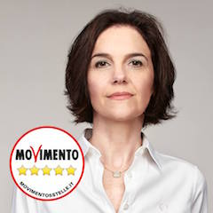

# Movimento 5 Stelle

- [Candidato Sindaco](#sara-montrasio-candidato-sindaco)
- [Lista Candidati](#lista-candidati)
- [Biografie Candidati](#biografie-candidati)
- [Programma](#programma)
- [Link e Risorse](#link-e-risorse)

## Sara Montrasio (candidato sindaco)

- [Facebook](https://www.facebook.com/montrasiodesio)

## Lista candidati

| Nome | Data di nascita | Biografia |
|------|-----------------|:---------:|
| Andrea Statzu | 11 aprile 70 | |
| Attilio Morciano | 30 maggio 62 | |
| Caterina La Malfa | 22 ottobre 74  | |
| Corrado Fossati | 5 ottobre 71 | |
| Daniela Rainoldi | 6 gennaio 66  | |
| Enrico Ainis | 5 maggio 78  | |
| Luca Gelosa | 4 gennaio 79 | [:link:](#luca-gelosa) |
| Luca Pace | 8 dicembre 76 | |
| Magda Giannattasio | 6 settembre 53 | |
| Marina Colombo | 15 agosto 60  | |
| Marzia Carpanelli | 22 aprile 78 | |
| Massimo Barbanti | 1 dicembre 70 | |
| Morris Arlati | 20 giugno 81  | |
| Oliviero Pelucchi | 18 dicembre 61  | |
| Paola Peretto | 29 giugno 67 | |
| Paolo Tiralongo | 24 ottobre 66  | |
| Pietro Silvia | 12 aprile 79  | |
| Roberto Castellazzi | 6 dicembre 44 | |
| Sonia Garofalo | 7 febbraio 81 | |

## Biografie candidati

### MORRIS ARLATI

**Chi sono**: Sposato e padre di un bimbo di 2 anni - Abito a Desio dal 2010 - Ho una Laurea magistrale in Scienze Economiche Aziendali, specializzazione in Legislazione delle Imprese - Impiegato contabile, lavoro presso un studio professionale e mi occupo di procedure fallimentari.

**Per Desio desidero**: una città a portata di bambino, con qualche parco in più e migliorare quelli presenti, piste ciclabili che non finiscano nel nulla

- il centro di Desio pedonale cercando di attrarre negozi anche con una politica di incentivi (sempre guardando il bilancio)
- creare eventi e attrarre pubblico anche dai paesi limitro
- attivare un servizio di trasporto pubblico per disincentivare l’uso dell’auto
- sistemare le scuole e rivalutare i beni storici della nostra città, come Villa Tittoni
   
### CATERINA LA MALFA

**Chi sono**: Convivo e sono mamma di due bambini, di 2 e 7 anni

- Abito a Desio da 10 anni
- Ho studiato Giurisprudenza ma sono ancora “laureanda”
- Sono una libera professionista, contabile.

**Per Desio desidero**: la sua rinascita! Mi piacerebbe incentivare lo sport, coinvolgendo giovani e meno giovani, mi piace dialogare e confrontarmi con la gente, vorrei che su tutti i tetti di Desio potessimo installare i pannelli fotovoltaici, vorrei far rivivere Desio con le idee di tutti e sfruttando ogni piccola risorsa che la città possiede, come le nostre due belle piazze. C’è tanto da fare a Desio, io posso promettere che il mio impegno sarà costante, perché Desio ha bisogno di tutti noi.
   
### LUCA GELOSA

**Chi sono**: impiegato, ho sempre lavorato nell’edilizia ma per via della crisi mi sono dovuto reinventare professionalmente. Padre di una bimba di due anni, per lei vorrei rendere Desio un luogo sicuro dove poter crescere. Ho molto a cuore la città: sono promotore di iniziative di volontariato. Sono Vicepresidente di un’associazione di promozione sociale, faccio parte del comitato del mio quartiere, del Controllo del Vicinato, del gruppo dei campanari della Basilica e sono consigliere della Casa di riposo.

**Per Desio desidero**: a rontare la disoccupazione: il lavoro è innanzitutto dignità e la dignità non dovrebbe essere negata a nessuno, far ri orire la nostra città per aiutare le piccole realtà commerciali e artigianali che sono il  ore all’occhiello del nostro territorio. Ma non solo. Creare nuovo lavoro promuovendo il Microcredito 5 Stelle.
   
### PAOLO TIRALONGO

**Chi sono**: siciliano, sposato da quasi 26 anni, ho un  glio di 24 e vivo a Desio da 10 anni. Ho sempre lavorato per aziende di autotrasporti come responsabile risorse umane e responsabile della logistica.

**Per Desio desidero**: più verde e meno cemento, riquali cazione degli immobili e più parchi attrezzati, sia per bambini che amici a 4 zampe. Priorità ai cittadini più bisognosi, sia sul lavoro che per la casa. Sicurezza e rispetto, sia dei propri beni che di quelli altrui. Ascoltare le persone che hanno problemi e aiutarle a risolverli. Aiutare gli immigrati a inserirsi nella comunità desiana coinvolgendoli
nel programma cittadino.
   
### MARINA COLOMBO

**Chi sono**: Avvocato settore civile-tributario con studio a Desio, sono stata Difensore Civico del Comune dal 2000 al 2005. Ho un  glio, Alessandro, laureato in Giurisprudenza. Sono stata “adottata” da Desio  n dai tempi del Liceo e poi mi ci sono trasferita e ho aperto il mio studio legale. Da Difensore Civico per cinque anni ho ricevuto i cittadini in Comune dove avevo un mio u cio. Ho partecipato come Difensore Civico a concorsi nazionali ricevendo anche un premio per un elaborato sui problemi della città. Ho promosso a Desio l’organizzazione di un convegno sull’entrata in vigore delll’Euro. Ho tenuto una rubrica sul quotidiano “Il Giorno” in materia di condomini.

**Per Desio desidero**: vorrei porre l’attenzione sulla sicurezza e sul rispetto della legalità, specie in questi momenti di gravissime tensioni e considerata la forte immigrazione avutasi in questi anni. Vorrei che si desse un’impronta urbanistica precisa che migliori l’aspetto cittadino e il verde pubblico, non solo quantitativamente ma qualitativamente.
   
### LUCA PACE

**Chi sono**: nato a Milano, residente a Desio dal 2006 con la mia famiglia, moglie e  glia che ora ha 6 anni. Diploma tecnico elettronico, lavoro da quasi venti anni in Trenitalia come tecnico controllo qualità e sicurezza del materiale rotabile. Donatore Avis dal 1995. Mi piace aiutare chi è più sfortunato di me, sono ottimista di natura, sempre attivo, non mi piace oziare, voglio sempre fare e curiosare. Attivista del Movimento 5 Stelle dal 2010 perché credo nella coerenza e nell’onestà.

**Per Desio desidero**: la partecipazione e la condivisone sono i miei ideali, vorrei fare semplicemente la mia parte da Cittadino Attivo per il bene comune, nessuna ricerca di consensi o poltrone, solo avere una città sempre più vivibile e apprezzata dai cittadini come me! OGNUNO DEVE FARE LA SUA PICCOLA PARTE
   
### PIETRO SILVIA

**Chi sono**: ho 37 anni, sono sposato e papà di tre figli.

Abito a Desio già da tanti anni, sono un artigiano edile con la passione del fai-da-te.

**Per Desio desidero**: che diventi una città nuova, una città aperta alle innovazioni, una città pulita e vivibile, con iniziative e attività che coinvolgano tutti i cittadini, qualcosa che sia a portata di famiglia. Desio deve ra orzare le attività commerciali che abbiamo e agevolare quelle nuove, non solo quelle che si a acciano sulle strade del centro. È inoltre necessaria una rete di trasporto pubblico e ciente, comoda e in linea con le richieste dei cittadini.
   
### PAOLA PERETTO

**Chi sono**: nata in provincia di Biella, abito a Desio dal 2007 con il mio compagno e nostra  glia di 9 anni. Dopo una lunga esperienza lavorativa in ambito contabile e amministrativo, ho deciso di mettermi in gioco come consulente. “Respiro” quotidianamente le di coltà che molte piccole imprese a rontano a causa della pressione  scale e di una crisi economica causata da scelte politiche che non le hanno tutelate. Questo e molti altri motivi mi hanno spinta a non  darmi più della “politica delle false promesse”. Sono una persona concreta. Attiva nel Movimento 5 Stelle dal 2009 e ancora prima nel “Comitato per l’alternativa all’inceneritore”.

**Per Desio desidero**: valorizzare le idee e le proposte dei cittadini. Mi piacerebbero luoghi d’incontro e aggregazione per bambini e ragazzi, una maggior valorizzazione dei luoghi d’interesse storico e culturale,  nalizzata anche a incrementare il commercio locale Vorrei poter contare su un sistema di sicurezza potenziato da telecamere (oltre che da una maggiore collaborazione tra cittadini).
   
### DANIELA RAINOLDI

**Chi sono**: cittadina desiana da generazioni e mamma di una ragazzo di 18 anni.

Laureata in lingue, lavoro come impiegata.

**Per Desio desidero**: il mio sogno è che Desio diventi una città a misura d’uomo, viva da un punto di vista culturale, sempre più verde e senza inceneritore. Una città dove bambini, ragazzi e anziani trovino gli spazi adatti alle loro esigenze, una città nella quale le istituzioni siano davvero al servizio dei cittadini.

## Programma

### 1. Ambiente e Salute

Tutto quello per cui ci battiamo da sempre: dalla gestione pulita dei rifiuti, senza incenerimento, allo stop a Pedemontana. Non è un fatto ideologico: vogliamo vivere in un ambiente più pulito per difendere la salute di tutti.

### 2. Mobilità Sostenibile

Vogliamo lavorare per creare un modo nuovo ed ecologico di muoversi, che non penalizzi le necessità dei cittadini, ma che li invogli a trovare nuove soluzioni. La nostra attenzione sarà per prima cosa indirizzata a disabili, anziani e a tutti coloro che non possono scegliere come spostarsi.

### 3. Turismo e Commercio

Vogliamo portare sempre più persone a Desio per far conoscere le sue bellezze e la sua storia, creando eventi di interesse più ampio e supportandoli con una comunicazione ef cace. Il tutto con la collaborazione e il coinvolgimento delle realtà commerciali desiane.

### 4. Cultura

Per noi cultura significa "non smettere mai di imparare". Dall'educazione civica all'alimentazione sana, lavoreremo per mettere a disposizione tutte le possibili competenze. Un altro nostro impegno è riportare il cinema a Desio e supportare il teatro.

### 5. Sport e Giovani

Ai giovani desiani serve più spazio per esprimersi, sia attraverso lo sport che le diverse forme di creatività. Vogliamo accompagnarli e dare loro luoghi adatti dove scegliere quali talenti sviluppare tra sport, musica, design, video, tecnologia, volontariato.

### 6. Sicurezza

Una città pulita, luminosa e solidale è più sicura. Cultura delle legalità, supporto ai cittadini che tengono gli occhi aperti sul territorio, sostegno e collaborazione con le forze dell'ordine, dispositivi per un maggiore controllo, sono le idee che vogliamo mettere in pratica.

### 7. Partecipazione

Vogliamo dare ai cittadini gli strumenti perché possano governare la città. Informare correttamente, insegnare a progettare, dialogare e decidere insieme. Sia che si tratti di bilancio partecipato che di decisioni che coinvolgono la città o i singoli quartieri.

### 8. Ascolto

Nessuno deve rimanere indietro. Vorremmo conoscere meglio i cittadini e le loro necessità, anche ascoltandoli uno a uno, mettendo a disposizione uno o più counselor che possano indirizzare le persone a compiere le scelte più adatte alle loro necessità, sul lavoro e nella vita di tutti i giorni.

### 9. Desio Verde

Riforestazione urbana: sempre più alberi, per regolare il clima e pulire l'aria. No alle potature selvagge. Verde pubblico sostenibile e minori costi di gestione grazie all'utilizzo di piante erbacee autoctone. Microgiardini e orti di quartiere. Spazi per picnic nei parchi e per i nostri amici animali.

### 10. La Città Creativa

Una nuova gestione degli spazi pubblicitari che diventano servizi. Creazione di bacheche nei quartieri e di una app comunale per dialogare meglio con i cittadini. Spazi per writers e speaker corner per poeti. Corsi notturni di fotografia per sorvegliare i quartieri. Passeggiate della salute. Spiaggia in città.

### 11. Lavoro e Impresa

Nuove competenze e collegamenti a sostegno di chi cerca lavoro o preferisce inventarne uno. Grazie a uno sportello dedicato daremo supporto per accedere al Microcredito M5S, fornendo un aiuto concreto a chi vuole mettere in pratica la sua idea imprenditoriale.

### 12. Quartiere Zero

Vogliamo studiare la fattibilità di un edificio, o complesso abitativo, a energia zero (edificio passivo), riqualificare uno spazio esistente rispettando i principi della bioedilizia. Un luogo che sia da abitare ma anche da esempio per chi vuole investire in progetti futuri.

### 13. Fondi Europei

Lavoreremo alla creazione di un team di consulenti che collaborino con rirosrse interne al Comune, opportunamente formate, per aderire a bandi europei che ci permettano di ottenere fondi utili per migliorare la nostra città (esempio: fondi per Smart Cities).

## Link e risorse

- [Programma](https://www.facebook.com/montrasiodesio/posts/1750862128517542)
- [Biografia candidati](https://www.facebook.com/montrasiodesio/posts/1750331395237282)
