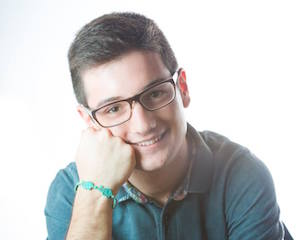
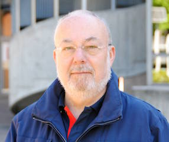
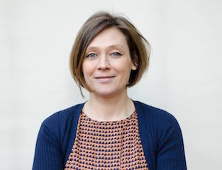
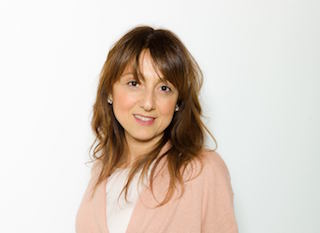
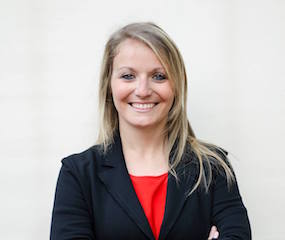
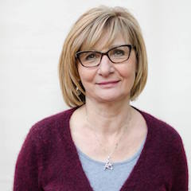
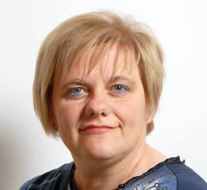
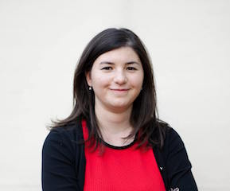
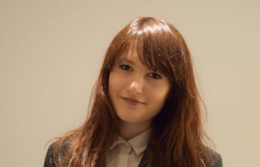
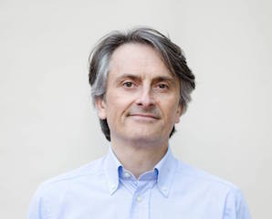

# Partito Democratico

Forza politica appartenente alla [coalizione di centro sinistra](coalizione-di-centro-sinistra.md) che supporta il candidato sindaco [Roberto Corti](coalizione-di-centro-sinistra.md#roberto-corti-candidato-sindaco).

- [Candidato Sindaco](coalizione-di-centro-sinistra.md#roberto-corti-candidato-sindaco)
- [Programma](coalizione-di-centro-sinistra.md#programma)
- [Biografie](#biografie)

## Lista candidati

| Nome | Occupazione | Data di nascita | Luogo di nascita | Foto | Biografia |
|------|-------------|-----------------|------------------|:----:|:---------:|
| Achille Taccagni | Studente di Giurisprudenza presso l’Università degli Studi di Milano | 26/09/1994 | Desio |  | [:link:](#achille-taccagni) |
| Alessio Alberti | | | | | |
| Angelo Mariani | consigliere comunale | | |  | |
| Angelo Russi | consigliere comunale | | | | |
| Cristina Redi | attuale assessore alla Cultura | | |  | |
| Dario Hueller | consigliere comunale, architetto | | | | |
| Emanuela La Greca | | | |  | |
| Emanuela Rocco | capogruppo in consiglio comunale | | | | |
| Gabriele Degan | | | | | |
| Giacomo Perini | | | |  | |
| Giorgio Gerosa | segretario del PD Desio | | | | |
| Jennifer Moro | assessore al Bilancio | | | | |
| Jenny Arienti | consigliere comunale | | |  | |
| Marialuisa Ricchiuti | | | |  | [:link:](#marialuisa-ricchiuti) |
| Mariangela Ravasi | | | |  | |
| Marta Sicurello | | | |  | |
| Massimo Carota | | | | | |
| Nunzia Smiraglia | | | | | |
| Paola Buonvicino | | | | | |
| Roberto Viganò | | | | | |
| Rocco Cicchetti | consigliere comunale | | | | |
| Sara Perego | | | |  | |
| Stefano Sala | | | |  | |
| Vanda Berra | consigliere comunale | | | | |

## Biografie

### Achille Taccagni

- **Occupazione**: Studente di Giurisprudenza presso l’Università degli Studi di Milano
- **Data di nascita**: 26/09/1994
- **Luogo di nascita**: Desio

Abito a Desio, in Corso Italia, da quando sono nato, e in questa città ho compiuto tutti gli studi fino al diploma di maturità classica ottenuto nel 2012 presso il Liceo Ettore Majorana, dove per due anni ho ricoperto la carica di Rappresentante degli Studenti.

In quel periodo ho cominciato ad interessarmi di politica locale, frequentando i consigli comunali e cercando di creare e mantenere rapporti diretti con l’Amministrazione in virtù del mio ruolo.

Finito il Liceo, ho seguito da vicino diverse realtà locali, di cui mi piace ricordarne soprattutto due: HubDesio e il Palio degli Zoccoli.

Per quanto riguarda il primo, ho partecipato attivamente alla nascita del primo programma (TRAM – DoveDesioVa) della web-radio ospitata e coordinata dal neonato Hub: una puntata ogni due settimane in cui raccontavamo la storia di diverse associazioni del territorio intervistandone i membri, mentre in una seconda “stagione” abbiamo intervistato tutti i membri dell’attuale Amministrazione.

Poi l’esperienza all’interno del Palio: ho ricoperto per due anni la carica di Maestro della mia contrada, San Pietro al Dosso, ed in seguito alla vittoria dei nostri corridori nell’edizione del 2014 sono stato insignito del titolo di Gran Maestro, rimanendo in carica fino all’ottobre 2015 dopodiché, come prevede la tradizione del Palio, mi sono preso il mio “anno sabbatico”.

Negli anni da Maestro e da Gran Maestro ho cercato, insieme ad altri ragazzi, di svecchiare l’immagine del Palio, creandone la pagina Facebook e rinnovandone il sito internet, cercando di avvicinare nuove persone e di migliorare i rapporti coi commercianti e con l’Amministrazione: è stata un’esperienza molto interessante, piena e senz’altro difficile, che spero di poter continuare in futuro.

Questi trascorsi nelle diverse realtà locali mi hanno fornito una buona conoscenza delle figure chiave e dei meccanismi dell’associazionismo locale, che certamente mi torneranno utili qualora venissi eletto Consigliere.

Amo la musica e amo farla: da qualche anno, col mio gruppo (la Banda Larga BeFolk) suono – cioè, canto – nei momenti in cui il centro è chiuso al traffico, sia durante i mercoledì sera d’estate sia durante i week-end sotto Natale. Non sapevo se inserirlo o meno in questa bio: magari non ti siamo piaciuti…

I tre punti su cui voglio impostare la mia campagna elettorale sono:

1. **Il rilancio di piazza don Giussani.** Sono fortemente convinto che questo luogo, dove vivo, non sia destinato a morire come molti dicono, e che anzi abbia le potenzialità per diventare più della “piazza dei bambini” proposta da qualcuno. A mio parere bisogna agire con due tipi di intervento, simultanei e complementari: uno strutturale e uno ludico-aggregativo. Il primo deve anzitutto ovviare ai problemi di costruzione (pavimentazione già deteriorata e in alcuni casi sconnessa, scarsità di ombra); successivamente deve fare in modo che la piazza diventi un punto di passaggio, e questo può essere fatto da un lato migliorando la segnaletica, soprattutto per chi arriva da fuori, e l’accessibilità al parcheggio sottostante, e dall’altro perfezionando il corridoio che passando per l’Avis, l’Aldo Moro e il vecchio ospedale collega la piazza don Giussani all’asse commerciale di Corso Italia-Via Garibaldi, rendendolo più visibile, riconoscibile e sicuro: in questo modo, soprattutto in momenti di chiusura del centro (Palio, mercoledì sera estivi, week-end invernali, festa patronale…), il parcheggio don Giussani diventerebbe il principale punto di appoggio per chi viene da fuori. Insieme a questo tipo di intervento, è necessario pensare ad un cartellone annuale di eventi che riempiano costantemente la piazza e che la rendano viva tutto l’anno. Questi due interventi permetteranno alla piazza di essere più frequentata e conosciuta; il passaggio e il continuo movimento creeranno più sicurezza percepita e quindi più appetibilità per le imprese che in futuro, si spera, in questo modo potrebbero di nuovo essere interessate ad aprire.
2. **Il rapporto fra gli studenti e l’Amministrazione.** Nei miei due anni da Rappresentante degli Studenti ho constatato la difficoltà di tenere rapporti con l’Amministrazione per la mancanza di un organo consultivo che coinvolgesse gli studenti superiori (il Consiglio Comunale dei Ragazzi termina con la scuola media). Per questo mi piacerebbe introdurre una Consulta Cittadina degli Studenti, composta dai Rappresentanti degli istituti superiori presenti sul territorio, da una rappresentanza degli universitari residenti a Desio eletta ad hoc, dall’Assessore alle Politiche Scolastiche e da quello alle Politiche Giovanili; la Consulta si ritroverebbe una volta al mese, col compito da una parte di sottoporre all’Amministrazione le esigenze degli studenti, le loro problematiche relative alla vita e allo studio sul territorio comunale nonché le loro proposte, e dall’altra parte di organizzare due “Giornate degli Studenti”: momenti, durante l’anno scolastico, di tipo ludico-aggregativo in cui gli studenti occupino uno spazio cittadino in autogestione per concerti, conferenze, esposizioni, eccetera. Un organo non solo consultivo quindi, ma con finalità integrative, di rinforzo dei rapporti fra gli studenti dei diversi istituti e di educazione al senso civico.
3. **La Biblioteca.** Vorrei che fosse più a misura di studente, a partire dall’orario che va esteso, abolendo la pausa pranzo (ora dalle 12.15 alle 14.30) e portando più in là l’orario di chiusura (ora alle 18.15): nelle nuove fasce d’apertura non sarà necessario garantire costantemente il servizio prestiti, che potrà continuare ad essere effettuato nell’orario attuale, ma sarà sufficiente garantire l’apertura e l’accessibilità degli spazi da parte di chi li sfrutta per studiare. Inoltre, sarebbe auspicabile una revisione degli spazi che coinvolga attivamente, in fase di progettazione, gli studenti stessi, che non saranno la categoria maggiormente utilizzatrice del servizio prestiti ma certamente sono la presenza più importante all’interno della struttura.

### Marialuisa Ricchiuti

Ho deciso di candidarmi a consigliere comunale. Desio deve continuare nell’esperienza di risanamento e di progresso della giunta Corti, il cui motto è stato e sarà **Il Benessere del Cittadino**. Non si deve tornare indietro. Per questo sono convinta di poter dare un contributo attivo.

Sposata con due figli, Alessandro e Federico, laureata in Mediazione linguistica e Culturale, vivo a Desio da oltre 30 anni. Provengo da una famiglia operaia, sempre solidale ed accogliente verso gli altri. Dai miei genitori ho appreso la cultura del lavoro, il senso della dignità e la curiosità per il mondo. Vivendo all’estero ho imparato che l’integrazione è sempre difficile ma è un processo tanto obbligato quanto arricchente. Tornata in Italia, dopo un periodo lavorativo ho continuato ad essere attiva negli organismi scolastici e nel volontariato presso l’Ente Nazionale Sordi di Monza e la Scuola di Italiano per Stranieri di Desio.

La passione per la politica che da sempre mi caratterizza è di forte stimolo per questa mia candidatura **e mi vedrà impegnata, se eletta, in due ambiti che mi stanno particolarmente a cuore: la Cultura e l’Ambiente.**

**A Desio si sono costituiti i Comitati di Quartiere**, per stimolare la partecipazione delle persone alla vita pubblica. **Nel mio quartiere – Spaccone –** ha iniziato la sua attività il Centro di Aggregazione dove vorrei realizzare una **Biblioteca Ambulante**: gli abitanti impossibilitati a recarsi alla Biblioteca Comunale, dopo aver prenotato i loro libri online, potranno ritirarli o restituirli direttamente qui. Vorrei dotare questo Centro di una connessione internet gratuita per offrire assistenza, con l’ausilio di un volontario civile, nei servizi online (es. prenotazioni sanitarie). Questo può divenire un progetto pilota da allargare anche in altri quartieri.

**La cultura deve essere anche di proprietà delle persone disabili.** Propongo, per la programmazione del cinema all’aperto d’estate in Villa Tittoni, qualche film con sottotitoli o qualche spettacolo teatrale in Lingua dei Segni per le persone sorde! Così come QR-code predisposti anche per persone disabili! Iniziative importanti a costi limitati!

**Con più di un milione di metri quadri salvati dal cemento**, Desio ha vinto il Premio Lombardia Urbanistica (2012), il Premio Legalità e Ambiente (2014) e piantumerà entro il 2016 **tredicimila alberi da foresta**. Proporrò di dotare le zone verdi dell’illuminazione necessaria per ridurre gli atti vandalici e, attraverso progetti da sviluppare con il **Consiglio Comunale dei Ragazzi e delle Ragazze**, elevare  il senso civico dei cittadini.

**Sostengo la posizione della giunta di arrivare in futuro a Rifiuti Zero: i rifiuti devono diventare una risorsa.** Già in alcuni comuni, beni durevoli come mobili, vestiti, infissi, sanitari, elettrodomestici, vengono riparati, riutilizzati e venduti, diventando fonti di nuova occupazione. Sono scelte a difesa del pianeta!

Con il Partito Democratico di Desio e nella coalizione che sostiene Roberto Corti questi temi trovano cittadinanza.

Se mi aiutate – BARRANDO ROBERTO CORTI SINDACO, IL SIMBOLO DEL PD E SCRIVENDO IL MIO COGNOME – continueremo su questa buona strada!

## Link e Risorse

- [articolo web](http://www.pddesio.com/?p=836)
