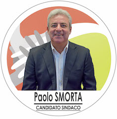

# Uniti Per Desio

- [Candidato Sindaco](#paolo-smorta-candidato-sindaco)
- [Lista Candidati](#lista-candidati)
- [Biografie Candidati](#biografie-candidati)
- [Programma](#programma)

## Paolo Smorta (Candidato Sindaco)

Paolo Smorta 24/07/1963 Gela (CL)

### Intervista 1

**Quali sono le priorità per la città?**

> «La priorità assoluta è quella di far ripartire Desio, con degli interventi immediati di riqualificazione degli edifici pubblici e privati abbandonati, degradati e dismessi. In città ce ne sono troppi (ndr l’ex casa di riposo di corso Italia, l’ex carcere, l’ex Agenzia delle Entrate ecc..) e non sono più tollerabili. Questo attiverà, a cascata, un circolo virtuoso sotto l’aspetto economico, con una serie di benefici per i cittadini, ma anche per gli imprenditori e i commercianti. E le entrate per il Comune potranno essere investite per la collettività. Poi bisogna trovare una soluzione per la Torre nell’area ex Autobianchi, noi delle idee le abbiamo».

**Quale sarebbe il suo primo atto ufficiale da sindaco?**

> «Sicuramente quello di far togliere i binari del tram che da troppi anni creano disagio e pericolo nell’asse centrale della città. Via le rotaie e spazio a una bella pista ciclabile, per dare un nuovo aspetto a tutto il centro».

**Perché i cittadini dovrebbero votare per lei?**

> «Semplice: perché a differenza di tutti gli altri ho dimostrato in questi anni da assessore di saper fare tante cose e tutte di qualità, per il bene di Desio e dei desiani. Ho dimostrato di saperle fare a prescindere dalle risorse economiche e di non fermarmi mai di fronte ai problemi, trovando sempre la soluzione più adeguata. C’è un altro modo di fare politica, il nostro e solo il nostro. Senza tessere in tasca, senza cambiali da pagare, senza scheletri negli armadi, fuori dalle vecchie logiche dei partiti, e da quel cancro che sono le coalizioni «accozzaglia», per costruire insieme, Uniti per Desio, una città migliore».

[Fonte](http://www.ilgiorno.it/monza-brianza/desio-candidati-sindaco-1.2139136)

## Lista Candidati

| Nome | Data di nascita | Comune di Nascita | Biografia | Foto |
|------|-----------------|-------------------|:---------:|:----:|
| Adriano Giacinto Manzotti | 03/07/1938 | Desio | | |
| Alessandra Redaelli | 30/11/1974 | Desio | |  |
| Andrea Perfetti | 10/09/1972 | Monza | |  |
| Andrea Sala | 09/06/1977 | Desio | |  |
| Angela Ines Vegro | 10/04/1961 | Milano | |  |
| Armando Melfi | 07/01/1961 | San Martino d’Agri (PZ) | |  |
| Claudio Colnaghi | 28/11/1988 | Monza | |  |
| Fabio Volpentesta | 21/07/1962 | Seregno | |  |
| Francesco Amedeo Alberto Nicolodi | 05/10/1967 | Desio | |  |
| Franco Barbirato | 30/09/1957 | Desio | |  |
| Isabella Barbara Marcella Gagliazzo | 20/03/1967 | Desio | |  |
| Laura Santina Crisopulli | 08/03/1961 | Bova Marina (RC) | |  |
| Marco Arienti | 04/11/1982 | Desio | |  |
| Matteo Sollami | 16/05/1978 | Desio | |  |
| Nicolò D'Argenio | 18/05/1994 | Desio | |  |
| Norma Cannizzo | 06/05/1974 | Enna | |  |
| Patrizia Destro | 27/06/1953 | Cavarzare (VE) | |  |
| Pieraldo Arienti | 25/04/1967 | Seregno | |  |
| Prisca Van Deursen | 03/05/1961 | San Paolo Brasile | |  |
| Renato Chiavegato | 05/11/1955 | Sorgà (VR) | |  |
| Samantha Terraneo | 25/04/1975 | Desio | |  |
| Sara Alessandrello | 12/10/1982 | Crotone | |  |
| Sara Consonni | 29/07/1974 | Desio | |  |
| Stefano Olmi | 04/01/1969 | Desio | |  |

## Programma

### FAR RIPARTIRE DESIO

Risultati di qualità con un nuovo modo di fare politica, libera dalle ideologie.

C'è la vecchia politica...fatta di scontri tra simboli, barriere ideologiche, pre-concetti, sotterfugi ; e c'è un modo nuovo, diverso, di fare politica : più aperto, senza barriere, se non quelle del rispetto delle regole e del buonsenso, dove in consiglio comunale, ad esempio, non ci sono steccati, non si celebrano dibattiti, round come se ci si trovasse su un ring, ma si collabora e si agisce per un obiettivo univoco: il bene di Desio.

C'è una politica dove comandano le Segreterie di partito per gli interessi di parte, una politica ormai superata, ammuffita, auto-demolitasi: in questa politica, il municipio è il “fortino” di chi comanda, a proprio piacimento, con ingressi selezionati e scaglionati, a proprio gusto.

E c'è invece una politica dove decidono i cittadini, UNITI, per il bene comune e concreto: una Desio migliore. In questa politica, la nostra, il Comune è una casa di vetro aperta a tutti, sempre, dove trovare, non ostacoli, tecnicismi e burocrazie, ma aiuto, supporto, collaborazione, che tu sia un semplice cittadino, una persona in difficoltà, un commerciante, un imprenditore.

L'impresa deve essere una risorsa per la città, non una minaccia: solo con una virtuosa collaborazione pubblico-privato si può far crescere la città, stimolarne lo sviluppo positivo, mettere in circolo capitali, difendere e creare posti di lavoro. Chi ha voglia e possibilità di investire, nel rispetto della legalità, deve essere incentivato, non demonizzato; solo così Desio può cancellare il ricordo dei tanti, troppi, edifici fantasma che oggi la popolano, diventando non solo un centro moderno e vivo, ma anche un epicentro economico per tutta la Brianza e anche oltre.

La cultura “del fare” deve essere quella che ci contraddistingue e non quella del “non-fare” e del contrapporsi; come nel caso degli eventi, che possano animare le nostre piazze tutti i weekend, per tutto l'anno, senza pause e come nello sport, nella cura della città, nella sicurezza, nel sociale, nell'ambiente, in ogni settore della vita pubblica e del territorio.

Tutti i settori devono essere sviluppati con una gestione intelligente, moderna, lungimirante, delle risorse economiche: ottimizzando le risorse, cancellando gli sprechi, trasformando le inefficienze in efficienze, i problemi in opportunità, sfruttando le potenzialità del “baratto” dei servizi dove possibile e con una capillare e costante azione di “raccolta” fondi, attraverso i tanti bandi regionali, nazionali ed europei a disposizione, sarà possibile ridurre i tributi locali.
C'è un altro modo di fare politica, il nostro e solo il nostro. Senza tessere in tasca, senza cambiali da pagare, senza scheletri negli armadi, fuori dalle vecchie logiche dei partiti, e da quel cancro che sono le coalizioni “accozzaglia”, per costruire insieme, UNITI PER DESIO, una città migliore.

### 1. Uniti per una efficace gestione del Comune.

Il municipio è il luogo in cui Amministrazione, “macchina comunale” e cittadino si incontrano.

Un luogo chiave della città, un luogo simbolo. Un luogo, una struttura, dove il cittadino, qualunque cittadino, deve sentirsi a suo agio, accolto, indirizzato, accompagnato.

Si tratta di un luogo fatto di persone: 200 impiegati che rappresentano una grande risorsa per la città e, come tali, devono poter esprimere al meglio le loro potenzialità individuali e di gruppo, secondo le linee guida dettate dalla politica.

Nel rapporto con gli utenti, poi, è fondamentale che abbiano una grande predisposizione caratteriale e mentale e un giusto e corretto rapporto con chi sta di fronte. Grazie ad un atteggiamento di ascolto, di supporto e di aiuto, il cittadino desiano quando va in municipio deve sentirsi a casa sua e non in un posto un po' nebuloso dove dover affrontare ostacoli o superare problemi.

Qui, i problemi, dovrà risolverli, trasformandoli in opportunità.

I dipendenti comunali sono la prima “interfaccia” della vita sociale ed è per questo che hanno un ruolo determinante sul vivere bene la città. Motivare i dipendenti, farli sentire ingranaggi essenziali: questo è il nostro impegno, per trasformare il loro lavoro in una missione, un orgoglio e un piacere.
Per il bene di Desio e dei desiani.

### 2. Uniti per un rilancio urbanistico.

Per poter far ripartire la città, l’Amministrazione comunale deve semplificare e incentivare le procedure amministrative relative al recupero del patrimonio edilizio pubblico e privato attuando una revisione al PGT e delle norme.

Creare una forte collaborazione fra l’Amministrazione e gli enti privati interessati per definire progetti comuni sugli edifici pubblici e privati, trovando il giusto equilibrio fra le parti, considerando che grossi investimenti economici possono essere fatti nella riqualificazione dell’ex casa di riposo, ex agenzia delle entrate, edifici dell’ex ospedale vecchio, ex tribunale, Asl, centro sportivo, ex carcere, grattacielo, ex Centrostile, ex Itis di via Manzoni e tanti altri edifici privati. Faremo in modo che questi enormi capitali possano essere la chiave di volta nell’economia cittadina, creando opportunità di lavoro e sostenendo le attività esistenti come artigiani, piccola media industria e commercio locale.

Realizzazione di una pista ciclabile al posto delle rotaie del tram che attraversi tutta la città da nord a sud.

Maggiore manutenzione delle aree verdi creando una collaborazione con gli enti privati e/o con i volontari per quanto concerne la manutenzione ordinaria.
Rivedere il piano dei parcheggi a pagamento (tariffe, orari) con la prima ora gratis nelle vie fortemente interessate dallo shopping.

Incentivare la riqualificazione degli edifici privati dismessi attraverso idonee politiche urbanistiche e fiscali oltre che  con una più ampia  collaborazione fra i soggetti interessati e l’Amministrazione comunale. Come noto, a Desio ci sono numerosi ed importanti   edifici pubblici dismessi da tempo: è ora di farli rivivere perché così sarà l’intera città a beneficiarne. Per trovare la migliore destinazione ed utilizzo occorre predisporre progetti di qualità. Se possibile, magari con il ricorso a nuovi finanziamenti ad hoc, saranno da preferire progetti portati avanti dall’Amministrazione, aperti però a collaborazioni con privati interessati ad investire, certamente senza svendite del patrimonio pubblico e possibilmente mediante concorsi d’idee con i migliori professionisti d’Italia.
Riqualificare la casa di riposo “Gavazzi” incentivando gli enti interessati a realizzare una struttura per anziani, composta da mini alloggi e con tutti i servizi necessari fruibili anche da parte degli altri cittadini della terza età (ambulatorio medico, palestra, sale comuni, mensa e lavanderia).

La “Torre” in questi anni è stata oggetto di accesso dibattito tra chi la vuole demolire e chi la vuole mantenere. Per noi è più utile pensare ad una sua valorizzazione , facendola diventare  un’opportunità per il territorio, rilanciandola incentivando ad esempio l’attenzione di importanti società nazionali e internazionali che possano completarla e destinarla a servizi utili. Adibire la Piazza Don Giussani a “Piazza dei bambini” realizzando un parco giochi e una mini pista per monocicli e pattini con ripetuti eventi destinati ai bambini.

Contrarietà al progetto della metrotranvia per via dei costi elevati, dei forti disagi per la viabilità e per tutte le attività commerciali che si affacciano sull’asse della via Milano. La vera alternativa alla metrotanvia è la metropolitana Milano-Como, già in progetto, dove faremo di tutto per far si che Desio ne sia attraversata.

### 3.  Uniti per un dinamico commercio e imprese.

Per poter far ripartire la città, l’Amministrazione comunale deve predisporre un progetto complessivo per rivitalizzare il centro storico e  gli assi Garibaldi/Corso Italia e Matteotti/Lampugnani puntando su un piano di decoro urbano condiviso con i commercianti, aumentando la sicurezza, incentivando nuove attività a insediarsi e organizzando eventi mirati di qualità per attrarre i cittadini di Desio e degli altri paesi limitrofi, in collaborazione con le società sportive e con le associazioni culturali.

Eventi in Piazza Conciliazione e negli assi Garibaldi/Corso Italia e Matteotti/Lampugnani.

Eventi sportivi per bambini in Piazza Don Giussani.

Eventi culturali in Piazza Martiri di Fossoli e in Villa Tittoni.

Eventi nei quartieri.

Sostenere le attività commerciali già presenti sul territorio e incentivarne l’apertura di nuove ,attraverso agevolazioni economiche e incentivi fiscali con l’obiettivo di non avere più locali commerciali vuoti/sfitti in città.

Riportare il commercio tradizionale nella zona centrale e non.

Rivedere i parcheggi a pagamento, tariffe e orari, soprattutto nelle aree di sviluppo dello shopping desiano, far conoscere e sfruttare al meglio i parcheggi già esistenti come quelli di Piazza Don Giussani, mercato via Grandi, Asl via Foscolo.

Creare una fidelity card gratuita per tutti i maggiorenni desiani, che permetta loro agevolazioni e sconti per gli acquisti fatti nelle attività commerciali e di servizi della città.

Incentivare nuove imprese artigiane e industriali a insediarsi nella nostra città proponendo sgravi fiscali, utilizzando capannoni/laboratori già esistenti e sfitti, agevolando in questo modo le assunzioni di disoccupati residenti a Desio.

### 4. Uniti per una Desio più sicura.

Tutti i cittadini devono essere regolari e avere un comportamento irreprensibile nei confronti della comunità e del patrimonio pubblico e privato, qualunque essa sia la loro provenienza, religione, orientamento politico. Applicheremo le sanzioni massime previste dalla legge per chi delinque e trasgredisce le regole di convivenza civile.

Per avere una città più sicura e protetta è necessario intervenire implementando il sistema di videosorveglianza e aumentando l’illuminazione pubblica nei luoghi più frequentati, come per esempio, piscina, campo sportivo, cimitero, chiese e nelle periferie, allargando il controllo con telecamere grazie anche all’intervento privato.

Installeremo sul territorio, in alcuni punti particolarmente a rischio, strumenti di segnalazione di pericolo, fissi e mobili. Essi saranno collegati con le forze dell’ordine, permetteranno quindi ai cittadini che si sentono minacciati di ricevere tempestivamente aiuto.

Meno agenti della polizia locale impegnati nelle pratiche burocratiche da ufficio, che vanno snellite e semplificate ove possibile, e di conseguenza più agenti sul territorio, con un controllo più capillare ed efficace della città, dei quartieri, del traffico, del rispetto del decoro urbano, dei fenomeni di microcriminalità.
Per mansioni come l'attraversamento pedonale fuori dalle scuole e il controllo durante eventi e manifestazioni di ampio respiro, prepareremo un piano organizzato d’intervento con associazioni di volontariato, protezione civile e carabinieri in pensione, che saranno di supporto alle forze dell’ordine.

Per la sicurezza reale e percepita del cittadino, proporremo dei corsi di formazione per la prevenzione e gestione del pericolo.

Creeremo un canale d’ascolto diretto con i cittadini per identificare i fattori di rischio, così da poter intervenire tempestivamente.

Garantiremo l’importante presenza della polizia locale anche in orari serali, specialmente nel periodo estivo. In accordo con gli stessi troveremo una soluzione che ne garantisca la realizzazione perché la percezione della sicurezza sia totalmente garantita a tutta la cittadinanza.

Affermeremo il divieto di creazione di campi nomadi, controllandone la presenza in città, contrastando fortemente l’accattonaggio molesto, dando agli organi di controllo tutti gli strumenti atti a evitare le situazioni critiche quali: sosta prolungata dei camper nei parcheggi cittadini, furti e microcriminalità. Disincentiveremo con forza il loro avvicinamento alla città e allontaneremo perentoriamente dal territorio chi non ha i requisiti per restare.
Siamo favorevoli ai gruppi di “Controllo del vicinato” di supporto agli organi competenti, polizia locale e carabinieri.

Potenzieremo nella scuola e nella vita sociale la cultura della legalità con programmi e giornate dedicate.

### 5. Uniti per un’equa politica sociale.

L'impegno sociale deve essere, per l'Amministrazione, un impegno forte, costante, naturale. Un impegno che deve essere focalizzato verso le cosiddette “fasce deboli” della popolazione: disabili, malati, stranieri, persone sole.

Per ognuna di esse occorre pensare progetti e percorsi di sostegno concreto, materiale e psicologico, in modo da alleviare le difficoltà, superare le barriere, limitare i disagi, per arrivare ad una “normalizzazione” del loro stato, ad un reinserimento nel cuore del contesto sociale.

Lo stesso va fatto nei confronti delle vecchie e nuove povertà, anche con piani di reinserimento lavorativo, sfruttando tutte le possibilità in questo senso (es.voucher, migliore coordinamento centri per il lavoro).

Occorre sempre agire in un'ottica di rete con i Comuni limitrofi (valorizzazione del Piano di Zona) e le realtà sul territorio (coinvolgimento delle associazioni di volontariato), ma anche con un’oculata gestione delle risorse che eviti ogni tipo di spreco o “monopolio” (e cercando sempre nuovi fondi tramite i vari Bandi pubblici a disposizione).

Il Comune deve rappresentare per ogni persona che vive in stato di bisogno un punto di riferimento, di fiducia, dove trovare risposte alle proprie necessità impellenti.

### 6. Uniti per un’istruzione di qualità.

Occorre verificare in maniera attenta lo stato di fatto di tutti gli edifici scolastici, intervenire per riqualificare le strutture e rendere gli edifici a norma per i bambini, i ragazzi e i disabili.

Creare all'interno dell'Ufficio Istruzione, uno sportello che gestisca il pronto intervento nella piccola manutenzione delle scuole, che si preoccupi di monitorare assiduamente i bandi regionali, statali ed europei per l’acquisto di materiali didattici, utili agli studenti e ai docenti, e che faccia da punto di raccordo e coordinamento tra dirigenze scolastiche, consigli d’istituto e comitati genitori.

Potenziare il segnale internet nelle scuole per maggior copertura della banda.

Fornire servizi di supporto per l’inserimento di alunni stranieri, garantendo la continuità del progetto di facilitazione linguistica e di mediazione culturale.
Promuovere e potenziare attività d’incontri formativi e di coinvolgimento per i genitori.

Favorire progetti di educazione alla salute volti a considerare un giusto rapporto con il cibo, con l’attività sportiva, con l’ambiente e l’adozione di uno stile di vita sano.

Una maggiore attenzione va sicuramente dedicata alla qualità del servizio mensa, alla pulizia delle strutture scolastiche e al materiale di cancelleria e igienico con monitoraggio periodico più frequente e attento.

Maggior attenzione ai servizi di supporto alla famiglia

Garantire i servizi di pre-post scuola.

Promuovere e potenziare le attività di orientamento scolastico, aiutando le famiglie e i ragazzi nel difficile compito della scelta della scuola di secondo grado col fine di evitare l’abbandono scolastico. Incrementare stages e tirocini formativi per gli studenti che si preparano ad entrare nel mondo del lavoro. Creare scambi culturali con paesi esteri per promuovere un migliore apprendimento delle lingue straniere.  

Creare un tempo scuola pomeridiano, nei giorni dove non previsto, per i ragazzi delle primarie di secondo grado, sfruttando l’opportunità di avere stagisti provenienti dalle scuole superiori.

Creare iniziative per permettere ai ragazzi di acquisire competenze professionali per inserirsi meglio nel mondo del lavoro.

Introdurre un sistema di facilitazione ed interscambio di materiale didattico.

### 7. Uniti per una valorizzazione della partecipazione.

La partecipazione dovrà essere uno dei capisaldi della società civile desiana. Una partecipazione vera, reale, efficace, strutturata, che arricchirà umanamente chi ne è protagonista e che avvantaggerà l’intera collettività .

Una partecipazione attiva da parte di tutti i cittadini, delle associazioni, delle società sportive, culturali e sociali, dei comitati di quartiere, dei volontari: ognuno, singolarmente o in gruppo, deve sentirsi ed essere una risorsa importante per la città.

Eventi pubblici, iniziative di solidarietà, manutenzione del verde, collaborazione all'uscita degli alunni dalle scuole, Controllo del vicinato: tutte queste, e molte altre, sono situazioni quotidiane importanti che grazie alla partecipazione dei cittadini possono essere affrontate con ottimi risultati e con un forte risparmio per la spesa pubblica di Desio.

Una delle categorie principali da coinvolgere è certamente quella dei pensionati, nei casi in cui abbiano ancora forza ed energia da poter abbinare a esperienza e saggezza: possono essere di grande aiuto per Desio e rendersi attivi e protagonisti nella loro città, con tutti i relativi benefici psico-fisici personali.
È necessario creare una Pro Loco Città di Desio che si farà carico di agevolare i rapporti tra pubblica amministrazione e le varie realtà attive nel campo della partecipazione.

### 8. Uniti per una cultura, sport ed eventi d’eccellenza.

#### 8.1 Cultura.

Facilitare collaborazioni con associazioni culturali e singoli cittadini creando sistematicamente eventi e manifestazioni di diverso indirizzo culturale come, pittura, arte, poesia, teatro, dando come riferimenti strutturali (location) tutti gli ambienti che si prestano come Villa Tittoni e Piazza Martiri dei Fossoli.
Villa Tittoni luogo di straordinaria bellezza sempre di più deve diventare la culla della cultura con mostre, convegni, manifestazioni e concorsi. Piazza Martiri dei Fossoli grazie alla collaborazione con le associazioni culturali deve diventare “la piazza del bello e delle arti”.

Valorizzazione dell’eccellente scuola di musica per portarla a livelli nazionali e internazionali come merita.

#### 8.2 Sport.

Supportare e collaborare con le quasi 50 società sportive e creare grazie ai 4700 praticanti desiani, un sistema sportivo eccellente ,mettendo a disposizione di questi e di tutti i cittadini desiani strutture sportive adeguate, sistemando le palestre che oggi sono al servizio delle società e rendendole tutte agibili. Il fiore all’occhiello dello sport desiano deve essere la Cittadella dello sport che deve comprendere il PalaBancoDesio al massimo della sua potenzialità, ospitando a pieno i 6700 spettatori e trovando un gestore che lo valorizzi con eventi sportivi e di spettacolo d’interesse nazionale ed internazionale.

Realizzare finalmente la palestra dedicata alla ginnastica ritmica da troppi anni attesa. Raddoppiare la piscina esistente con una vasca ludico/terapeutica e soprattutto intervenire al centro sportivo facendolo diventare un centro di eccellenza nazionale. Al suo interno le tre discipline esistenti diventeranno diciotto e sarà provvisto di servizi importanti come: bar/ristorante, centro di medicina sportiva, negozi sportivi, foresteria, kinder club e beauty farm.

Agevolare le attività sportive delle società inserendole negli eventi cittadini e promuovere la comunicazione tra le società sportive e gli istituti scolastici favorendo in questo modo una maggiore diffusione della “cultura sportiva”.

#### 8.3 Eventi.

Importantissimo per Desio e il commercio desiano è organizzare eventi di diversa natura nelle piazze e nei quartieri. Tutti i week end in piazza Conciliazione e nel centro saranno organizzati eventi per rispondere alle aspettative dei cittadini e dei commercianti.

Le piazze, il PalaBancoDesio, il parco, la Villa Tittoni sono luoghi perfetti per organizzare eventi di qualità per i desiani e per tutti coloro che, provenendo da fuori, grazie a questi eventi possono avvicinarsi alla nostra città.

Da 4 anni Desio con i mercoledì sera estivi è diventata l’epicentro delle serate brianzole ed è per questo che sempre più ci sarà un impegno a renderli riferimento di eccellenza locale.

### 9. Uniti per un sano e pulito ambiente.

L'ambiente è, per sua stessa definizione, qualcosa che riguarda tutti noi, in ogni momento. Per questo deve essere tutelato con grande attenzione, per garantire anzitutto la salute dei cittadini.

Occorre incentivare con opportune strategie e numerosi progetti la cosiddetta mobilità lenta (biciclette e pedoni) in maniera da diminuire il traffico in città e, di conseguenza, lo smog.

Occorre vincere le tesi drastiche nei confronti del Forno inceneritore attivo sul nostro territorio che puntano alla sua chiusura: è un’ipotesi che non sta in piedi e che significherebbe immediati e gravi problemi nella gestione dei rifiuti e nella gestione del Teleriscaldamento (che è già attivo in numerosi impianti ed edifici pubblici della città), con dei servizi che andrebbero a costare molto di più, in maniera insostenibile. Ecco perché bisogna vedere il Forno come una risorsa della nostra città che deve essere controllata e monitorata in maniera costante, precisa, puntuale. La salute dei cittadini è più importante di ogni altra cosa, bisogna quindi salvaguardare i servizi offerti dal Forno (e i posti di lavoro) investendo più possibile in tecnologie che possano abbattere e ridurre quasi a zero l'impatto dell'incenerimento sull'area circostante.

Un sano e pulito ambiente deve essere anche un ambiente pienamente fruibile da parte dei cittadini. Ecco che le aree verdi, grande patrimonio della nostra città, devono non solo essere tutelate e aumentate, ma anche rese davvero fruibili e godibili da parte dei cittadini, con interventi e attrezzature ad hoc.
Per difendere l'ambiente promuoveremo politiche di riqualificazione urbanistica che non andranno a intaccare nuove aree ma punteranno sui tanti edifici e capannoni dismessi e sfitti in città.

Sul fronte dei rifiuti potenzieremo il più possibile i servizi, promuovendo una maggiore raccolta differenziata e disincentivando gli incivili che scaricano abusivamente sul territorio: ad esempio ampliando gli orari di apertura della Piattaforma ecologica.

Tramite un forte impegno educativo e di sensibilizzazione, nelle scuole e nelle famiglie, attiveremo un circuito virtuoso che permetterà di arrivare a un adeguato e corretto riciclo dei rifiuti in maniera naturale e spontanea. Chi continuerà a trasgredire sarà punito in maniera determinata.

### 10. Uniti per un’attenta politica della persona

Ogni singolo cittadino è una persona, con proprie caratteristiche, peculiarità, bisogni e aspettative. Per quanto possibile occorre andare incontro a ognuna di esse. Ci sono fasce d'età più critiche, che meritano un’attenzione particolare, forte.

#### 10.1 Infanzia.

Per questa fascia d'età proporremo e coordineremo una serie d’iniziative e progetti per dare spazi, eventi e opportunità a tutti i bambini e le bambine, in modo che possano avviarsi a una vita attiva e in salute. Favorendo attività di socializzazione e ludiche tanto importanti per la crescita dei più piccoli.

#### 10.2 Adolescenti.

Si tratta di una fascia d'età critica, un periodo di passaggio decisivo per la formazione della persona. Per questo occorre dare la possibilità ai ragazzi e alle ragazze di esprimere le proprie potenzialità, i propri talenti e la propria creatività, in spazi e strutture adeguate, non solo quelli esistenti (scuole, parchi, oratori) ma anche nuovi (sala prove, pista di skate ecc.).

#### 10.3 Famiglie.

Ogni famiglia dovrà tornare a sentirsi orgogliosa di vivere a Desio. Dovrà farlo essendo incentivata a partecipare attivamente alla vita sociale. In questa direzione andranno gli eventi e le opportunità che saranno creati dal Comune, insieme alle associazioni, durante tutto il corso dell'anno. Desio non sarà vissuta da nessuno come una città dormitorio ma come una città dove è piacevole e coinvolgente risiedere.

#### 10.4 Terza Età.

Oltre al normale sostegno e aiuto sotto l'aspetto fisico, morale e sanitario, gli anziani della città riceveranno un ricco ventaglio di proposte per vivere in maniera attiva, per utilizzare in maniera propositiva il tempo, in nuovi spazi e con nuove forme di aggregazione. Potranno quindi usufruire di sale ludiche, dove incontrarsi e partecipare ad attività d’intrattenimento, sale da ballo, spazi per attività culturali ed artistiche.
